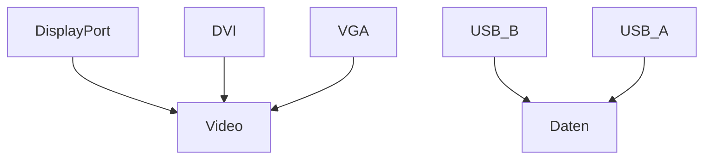

---
# Identity (stable; never change after publishing)
id: ap1-0162
slug: schnittstellen-erkennen

# Display
title: "Schnittstellen erkennen (DisplayPort, DVI, VGA, USB)"

# Classification / navigation (machine-side)
module: "Beurteilen marktgängiger IT-Systeme und Lösungen"
topics: ["Hardware", "Schnittstellen"]
tags: ["prüfungsrelevant", "bilderkennung"]

# Flashcard payload
card:
  type: basic
  question: "Welche Schnittstellen sind auf dem Bild zu sehen?"
  answer: "DisplayPort, DVI, VGA, USB Typ B und zwei USB Typ A."
  examples:
    - "DisplayPort → digitale Videoübertragung"
    - "DVI → digitale bzw. digitale/analoge Bildübertragung"
    - "VGA → analoge Videoschnittstelle"
    - "USB Typ B → häufig bei Druckern oder Monitor-Hubs"
    - "USB Typ A → Standard-USB-Anschluss für Peripheriegeräte"

# Lifecycle
status: published
created: "2026-03-12"
updated: "2026-03-12"
---

## Schnittstellen erkennen (DisplayPort, DVI, VGA, USB)

Auf dem Bild sind mehrere **typische Schnittstellen eines Monitors oder Dockinggeräts** zu erkennen.

Sie dienen hauptsächlich zur:

- **Videoübertragung**
- **Datenübertragung über USB**

---

## Erkannte Schnittstellen

| Schnittstelle | Typ | Verwendung |
|---|---|---|
| DisplayPort | Video | Digitale Bild- und Audioübertragung |
| DVI | Video | Digitale oder digitale/analoge Videoübertragung |
| VGA | Video | Ältere analoge Videoschnittstelle |
| USB Typ B | Daten | Verbindung z. B. zwischen Monitor/Drucker und Computer |
| USB Typ A (2×) | Daten | Anschluss von USB-Geräten |

---

## Typische Position im Bild

Die Anschlüsse befinden sich (von oben nach unten):

1. **DisplayPort**
2. **DVI**
3. **VGA**
4. **USB Typ B**
5. **2× USB Typ A**

---

## Vereinfachtes Schema

---

## Wichtige Eigenschaften

| Schnittstelle | Besonderheit |
|---|---|
| DisplayPort | moderner digitaler Standard |
| DVI | älterer digitaler Monitoranschluss |
| VGA | analoger Anschluss, heute selten |
| USB Typ B | häufig bei Druckern oder Monitor-Hubs |
| USB Typ A | Standardanschluss für USB-Geräte |

---

## Prüfungsrelevanz (IHK / AP1)

Typische Aufgaben:

- **Schnittstellen anhand eines Bildes erkennen**
- Unterschied zwischen **analogen und digitalen Videoanschlüssen**
- Zuordnung von **USB-Steckertypen**

**Merksatz**

> DisplayPort, DVI und VGA sind Videoschnittstellen, während USB Typ A und Typ B zur Datenübertragung dienen.

---