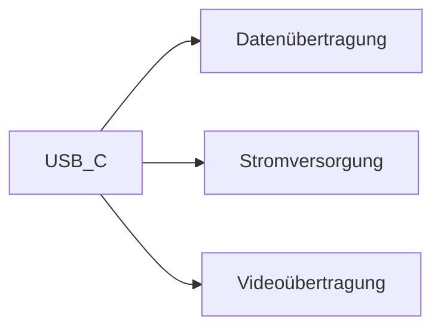

---
# Identity (stable; never change after publishing)
id: ap1-0163
slug: usb-c-vorteile

# Display
title: "Vorteile von USB-C"

# Classification / navigation (machine-side)
module: "Beurteilen marktgängiger IT-Systeme und Lösungen"
topics: ["Hardware", "Schnittstellen"]
tags: ["prüfungsrelevant", "grundlagen"]

# Flashcard payload
card:
  type: multi
  question: "Nenne Vorteile des USB-C-Anschlusses gegenüber den USB-Typen A und B."
  answer: "USB-C bietet mehrere Vorteile gegenüber USB-A und USB-B: reversible Steckrichtung, höhere Leistungsfähigkeit (höhere Datenraten), kompaktere Bauform, schnellere Ladezeiten, bidirektionale Stromversorgung und bessere Zukunftssicherheit."
  examples:
    - "Stecker kann beidseitig eingesteckt werden"
    - "Unterstützt höhere Datenraten (z. B. USB 3.x / USB4)"
    - "Power Delivery ermöglicht schnelles Laden von Geräten"

# Lifecycle
status: published
created: "2026-03-12"
updated: "2026-03-12"
---

## Vorteile von USB-C

**USB-C (USB Type-C)** ist ein moderner USB-Steckertyp, der entwickelt wurde, um ältere USB-Stecker wie **USB-A** und **USB-B** zu ersetzen.

Er vereint **Datenübertragung, Stromversorgung und teilweise Videoübertragung** in einem einzigen Anschluss.

---

## Vorteile von USB-C

| Vorteil | Beschreibung |
|---|---|
| Reversible Steckrichtung | Stecker kann in beide Richtungen eingesteckt werden |
| Höhere Leistungsfähigkeit | Unterstützt hohe Datenraten (z. B. USB 3.2, USB4) |
| Kompaktes Design | Kleiner und symmetrischer Stecker |
| Schnellere Ladezeiten | Unterstützung von **USB Power Delivery (PD)** |
| Bidirektionale Stromversorgung | Geräte können Strom senden oder empfangen |
| Zukunftssicherheit | Standard für viele moderne Geräte |

---

## Funktionsprinzip

USB-C kann mehrere Funktionen über denselben Anschluss bereitstellen:

Dadurch kann ein einzelnes Kabel z. B.:

- einen **Laptop laden**
- gleichzeitig **Daten übertragen**
- und **einen Monitor anschließen**

---

## Beispiel aus der Praxis

Moderne **Notebooks und Smartphones** nutzen USB-C für:

- Laden des Geräts  
- Anschluss von **Dockingstationen**  
- Verbindung mit **Monitoren (DisplayPort Alt Mode)**  
- Datenübertragung mit hoher Geschwindigkeit  

---

## Prüfungsrelevanz (IHK / AP1)

Typische Prüfungsfragen:

- Vorteile von **USB-C gegenüber USB-A/B**
- Eigenschaften von **USB-C-Steckern**
- Zusammenhang mit **USB Power Delivery**

**Merksatz**

> USB-C ist ein moderner, universeller Anschluss für Daten, Strom und teilweise Videoübertragung mit hoher Leistung und reversibler Steckrichtung.

---