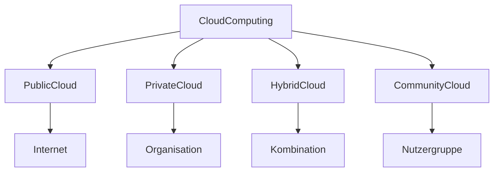

---
# Identity (stable; never change after publishing)
id: ap1-0164
slug: cloud-formen

# Display
title: "Cloud-Formen im Cloud Computing"

# Classification / navigation (machine-side)
module: "Beurteilen marktgängiger IT-Systeme und Lösungen"
topics: ["Cloud Computing"]
tags: ["prüfungsrelevant", "grundlagen"]

# Flashcard payload
card:
  type: multi
  question: "Nenne die verschiedenen Cloud-Formen, die durch Cloud Computing angeboten werden."
  answer: "Die wichtigsten Cloud-Formen sind: Public Cloud, Private Cloud, Hybrid Cloud und Community Cloud. Zusätzlich existieren Mischformen wie Virtual Private Cloud und Multi Cloud."
  examples:
    - "Public Cloud → öffentlich zugängliche Cloud-Infrastruktur"
    - "Private Cloud → Cloud nur für eine Organisation"
    - "Hybrid Cloud → Kombination aus Public und Private Cloud"
    - "Community Cloud → Cloud für eine bestimmte Nutzergruppe"

# Lifecycle
status: published
created: "2026-03-12"
updated: "2026-03-12"
---

## Cloud-Formen im Cloud Computing

Cloud Computing stellt **IT-Ressourcen wie Speicher, Rechenleistung oder Anwendungen über das Internet** bereit.

Je nach **Zugriff, Eigentum und Nutzung** unterscheidet man verschiedene **Cloud-Formen**.

---

## Wichtige Cloud-Formen

| Cloud-Typ | Beschreibung |
|---|---|
| Public Cloud | Öffentliche Cloud-Infrastruktur, die über das Internet für viele Nutzer verfügbar ist |
| Private Cloud | Cloud-Infrastruktur, die ausschließlich von einer Organisation genutzt wird |
| Hybrid Cloud | Kombination aus Public Cloud und Private Cloud |
| Community Cloud | Cloud-Infrastruktur für eine bestimmte Nutzergruppe mit gemeinsamen Interessen |

---

## Weitere Mischformen

Neben den klassischen Modellen existieren zusätzliche Varianten:

| Cloud-Modell | Beschreibung |
|---|---|
| Virtual Private Cloud (VPC) | Private Cloud-Umgebung innerhalb einer Public Cloud |
| Multi Cloud | Nutzung mehrerer Cloud-Anbieter gleichzeitig |

---

## Architekturübersicht

---

## Typische Beispiele

| Cloud-Typ | Beispiel |
|---|---|
| Public Cloud | Dienste großer Cloud-Anbieter |
| Private Cloud | Unternehmensinterne Cloud-Infrastruktur |
| Hybrid Cloud | lokale Infrastruktur + Cloud-Dienste |
| Community Cloud | Cloud für Forschungseinrichtungen |

---

## Prüfungsrelevanz (IHK / AP1)

Typische Fragen:

- Nennung der **Cloud-Formen**
- Unterschied zwischen **Public und Private Cloud**
- Bedeutung von **Hybrid Cloud**

**Merksatz**

> Cloud-Formen unterscheiden sich vor allem darin, **wer Zugriff auf die Cloud-Infrastruktur hat und wie sie betrieben wird**.

---