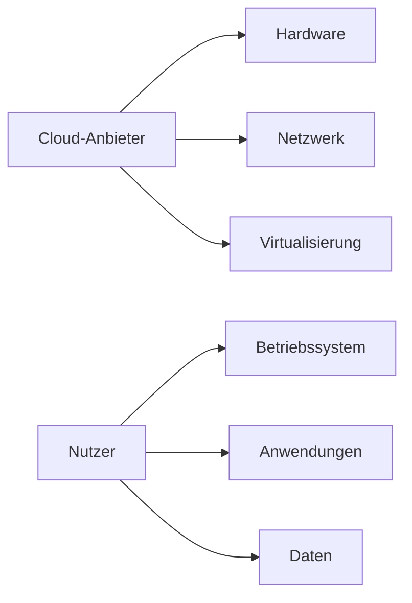

---
# Identity (stable; never change after publishing)
id: ap1-0166
slug: iaas

# Display
title: "Infrastructure as a Service (IaaS)"

# Classification / navigation (machine-side)
module: "Beurteilen marktgängiger IT-Systeme und Lösungen"
topics: ["Cloud Computing", "Servicemodelle"]
tags: ["prüfungsrelevant", "definition"]

# Flashcard payload
card:
  type: definition
  question: "Erkläre den Begriff des Servicemodells Infrastructure as a Service (IaaS)."
  answer: "Infrastructure as a Service (IaaS) ist ein Cloud-Servicemodell, bei dem grundlegende IT-Infrastruktur wie Server, Speicher und Netzwerke über das Internet bereitgestellt werden. Der Anbieter stellt die Infrastruktur bereit, während der Nutzer seine eigenen virtuellen Maschinen und Systeme selbst verwaltet."
  examples:
    - "Virtuelle Server in der Cloud"
    - "Cloud-Speicher und Netzwerkinfrastruktur"
    - "Beispielanbieter: AWS EC2, Microsoft Azure VM"

# Lifecycle
status: published
created: "2026-03-12"
updated: "2026-03-12"
---

## Infrastructure as a Service (IaaS)

**Infrastructure as a Service (IaaS)** – manchmal auch **Foundation** genannt – ist ein Cloud-Computing-Servicemodell, das als **Ersatz oder Erweiterung klassischer Rechenzentren** dient.

Dabei stellt der Cloud-Anbieter grundlegende **IT-Infrastrukturressourcen** bereit, auf die der Nutzer über das Internet zugreifen kann.

Der Benutzer nutzt vorhandene Cloud-Dienste, **verwaltet aber seine eigenen virtuellen Rechnerinstanzen selbst**.

---

## Bereitgestellte Ressourcen

Typischerweise umfasst IaaS:

| Ressource | Beschreibung |
|---|---|
| Rechenleistung | Virtuelle Maschinen / Server |
| Speicher | Block- oder Objektspeicher |
| Netzwerk | virtuelle Netzwerke, Firewalls, IP-Adressen |

---

## Verantwortungsmodell

**Cloud-Anbieter verwaltet**

- Hardware
- Rechenzentrum
- Netzwerk
- Virtualisierung

**Kunde verwaltet**

- Betriebssystem
- Software
- Anwendungen
- Daten

---

## Beispiel aus der Praxis

Ein Unternehmen benötigt kurzfristig zusätzliche Serverkapazität.

Statt neue Hardware zu kaufen:

1. Es erstellt **virtuelle Maschinen in der Cloud**
2. installiert dort **sein Betriebssystem**
3. betreibt **seine Anwendungen**

→ Die Infrastruktur wird gemietet statt gekauft.

---

## Prüfungsrelevanz (AP1)

Typische Prüfungsfragen:

- Definition von **IaaS**
- Unterschiede zwischen **IaaS, PaaS und SaaS**
- Verantwortungsverteilung zwischen **Provider und Kunde**

**Merksatz**

> Bei **IaaS** stellt der Anbieter die Infrastruktur bereit, der Kunde verwaltet Betriebssystem, Anwendungen und Daten selbst.

---