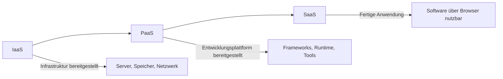

---
# Identity (stable; never change after publishing)
id: ap1-0167
slug: paas-vorteile

# Display
title: "Vorteile von Platform as a Service (PaaS)"

# Classification / navigation (machine-side)
module: "Beurteilen marktgängiger IT-Systeme und Lösungen"
topics: ["Cloud Computing", "Servicemodelle"]
tags: ["prüfungsrelevant", "cloud"]

# Flashcard payload
card:
  type: multi
  question: "Welche Vorteile bietet das Servicemodell PaaS (Platform as a Service)?"
  answer: |
    - Reduzierter Programmieraufwand durch vorhandene Entwicklungstools
    - Zusätzliche Entwicklungsmöglichkeiten durch vorgefertigte Komponenten
    - Einfachere Entwicklung für mehrere Plattformen
    - Kostengünstige Nutzung der Entwicklungswerkzeuge
    - Effiziente Verwaltung des Anwendungslebenszyklus
  examples:
    - "Cloud-Entwicklungsplattformen wie Google App Engine oder Heroku"
    - "Bereitstellung von Entwicklungsframeworks und Datenbanken durch den Cloud-Anbieter"

# Lifecycle
status: published
created: "2026-03-12"
updated: "2026-03-12"
---

## Vorteile von Platform as a Service (PaaS)

**Platform as a Service (PaaS)** ist ein Cloud-Servicemodell, bei dem der Anbieter eine **komplette Entwicklungsplattform** zur Verfügung stellt.

Diese Plattform enthält bereits:

- Entwicklungsumgebungen  
- Frameworks  
- Datenbanken  
- Tools für Deployment und Skalierung  

Entwickler können sich dadurch **auf die Entwicklung der Anwendungen konzentrieren**, ohne sich um Infrastruktur oder Plattformverwaltung kümmern zu müssen.

---

## Vorteile von PaaS

| Vorteil | Erklärung |
|---|---|
| Reduzierter Programmieraufwand | Entwicklungswerkzeuge und Frameworks werden bereits bereitgestellt |
| Erweiterte Entwicklungsmöglichkeiten | Vorgefertigte Komponenten können direkt genutzt werden |
| Plattformübergreifende Entwicklung | Anwendungen können für verschiedene Geräte oder Browser entwickelt werden |
| Kosteneffizienz | Tools und Infrastruktur müssen nicht selbst betrieben werden |
| Verwaltung des Lebenszyklus | Deployment, Updates und Skalierung werden unterstützt |

---

## Beispiel aus der Praxis

Ein Entwicklerteam möchte eine Webanwendung erstellen.

Statt:

- Server zu konfigurieren  
- Datenbanken zu installieren  
- Entwicklungsumgebungen aufzusetzen  

nutzen sie eine **PaaS-Plattform**.

Dort können sie direkt:

1. Code hochladen  
2. Anwendung testen  
3. Anwendung automatisch deployen  

---

## Einordnung der Cloud-Servicemodelle

---

## Prüfungsrelevanz (AP1)

Typische Aufgaben:

- Vorteile von **PaaS aufzählen**
- Unterschiede zwischen **IaaS, PaaS und SaaS**
- Einsatz von PaaS in **Softwareentwicklung**

**Merksatz**

> PaaS stellt Entwicklern eine fertige Plattform bereit, damit sie Anwendungen entwickeln können, ohne sich um Infrastruktur kümmern zu müssen.

---