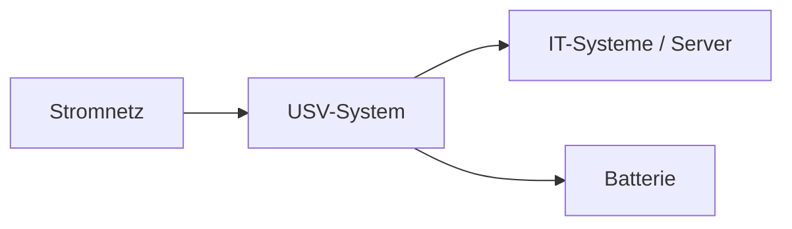

---
# Identity (stable; never change after publishing)
id: ap1-0170
slug: usv-klassen

# Display
title: "USV-Klassen nach IEC 62040-3"

# Classification / navigation (machine-side)
module: "Beurteilen marktgängiger IT-Systeme und Lösungen"
topics: ["Hardware", "Stromversorgung", "Rechenzentrum"]
tags: ["prüfungsrelevant", "definition"]

# Flashcard payload
card:
  type: multi
  question: "Welche drei USV-Klassen gibt es nach IEC 62040-3 und wie funktionieren sie?"
  answer: |
    - **VFI (Voltage and Frequency Independent)** – Die Ausgangsspannung ist vollständig unabhängig vom Stromnetz. Schützt vor Stromausfall, Unterspannung, Überspannung, Frequenzschwankungen und Oberschwingungen.
    - **VI (Voltage Independent)** – Schützt vor Stromausfall, Unterspannung und Überspannung. Die Frequenz bleibt vom Stromnetz abhängig.
    - **VFD (Voltage and Frequency Dependent)** – Grundlegender Schutz vor Stromausfall, jedoch mit einer Umschaltverzögerung (bis etwa 10 ms). Spannung und Frequenz sind vom Netz abhängig.
  examples:
    - "VFI: Online-USV in Rechenzentren"
    - "VI: Line-Interactive-USV für Serverräume"
    - "VFD: einfache Offline-USV für PCs"

# Lifecycle
status: published
created: "2026-03-12"
updated: "2026-03-12"
---

## USV-Klassen nach IEC 62040-3

Eine **Unterbrechungsfreie Stromversorgung (USV)** schützt IT-Systeme vor Problemen in der Stromversorgung, z. B.:

- Stromausfall  
- Unterspannung  
- Überspannung  
- Spannungsschwankungen  

Nach der **Norm IEC 62040-3** werden USV-Systeme in **drei Klassen** eingeteilt.

---

## Die drei USV-Klassen

| Klasse | Bedeutung | Eigenschaften |
|---|---|---|
| **VFI** | Voltage and Frequency Independent | Ausgangsspannung und Frequenz vollständig vom Stromnetz entkoppelt |
| **VI** | Voltage Independent | Spannung wird geregelt, Frequenz bleibt abhängig vom Netz |
| **VFD** | Voltage and Frequency Dependent | Spannung und Frequenz folgen dem Netz |

---

## Funktionsprinzip

Bei einem **Stromausfall** übernimmt die **Batterie der USV** kurzfristig die Versorgung der angeschlossenen Geräte.

---

## Unterschiede im Detail

### Klasse 1 – VFI (Online-USV)

- vollständige Entkopplung vom Stromnetz  
- schützt vor:
  - Stromausfall
  - Unterspannung
  - Überspannung
  - Frequenzschwankungen
  - Oberschwingungen  
- höchste Schutzklasse  
- typischer Einsatz: **Rechenzentren**

---

### Klasse 2 – VI (Line-Interactive)

- schützt vor:
  - Stromausfall
  - Unterspannung
  - Überspannung  
- Spannung wird stabilisiert  
- Frequenz bleibt abhängig vom Netz  
- Einsatz: **Serverräume, Netzwerkschränke**

---

### Klasse 3 – VFD (Offline-USV)

- grundlegender Schutz vor Stromausfall  
- Umschaltzeit bis etwa **10 ms**  
- Spannung und Frequenz abhängig vom Stromnetz  
- Einsatz: **Einzel-PCs, Arbeitsplätze**

---

## Prüfungsrelevanz (AP1)

Typische Prüfungsfragen:

- **USV-Klassen nennen**
- Unterschiede zwischen **VFI, VI und VFD**
- Einsatzbereiche der verschiedenen USV-Typen

**Merksatz**

> Je unabhängiger eine USV vom Stromnetz arbeitet, desto höher ist die Schutzklasse.

---