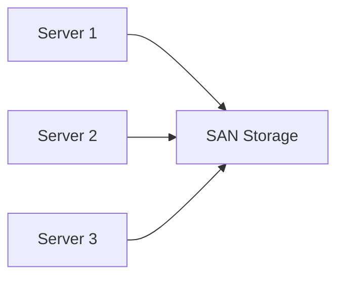

---
# Identity (stable; never change after publishing)
id: ap1-0179
slug: "storage-area-network"

# Display
title: "Storage Area Network (SAN)"

# Classification / navigation (machine-side)
module: "Beurteilen marktgängiger IT-Systeme und Lösungen"
topics: ["Speicherlösungen", "Netzwerke"]
tags: ["definition","prüfungsrelevant"]

# Flashcard payload
card:
  type: definition
  question: "Erkläre den Begriff Storage Area Network (SAN)."
  answer: "Ein Storage Area Network (SAN) ist ein dediziertes Netzwerk für blockbasierten Speicher, über das Server direkt auf zentrale Speicherressourcen zugreifen."
  examples:
    - "Mehrere Server greifen in einem Rechenzentrum über Fibre Channel auf ein gemeinsames SAN zu."
    - "Ein Virtualisierungscluster nutzt ein SAN für gemeinsame Datenspeicher."
    - "iSCSI ermöglicht SAN-Zugriffe über ein IP-Netzwerk."

# Lifecycle
status: published
created: "2026-03-14"
updated: "2026-03-14"
---

<!-- Optional: extra explanation, diagrams, tables, links, etc.
     Keep the "answer" concise; put longer context here if useful. -->

## Storage Area Network (SAN)

Ein **Storage Area Network (SAN)** ist ein **spezialisiertes Netzwerk für Speicherzugriffe**, das Servern ermöglicht, direkt auf zentrale Speicherressourcen zuzugreifen.

Im Gegensatz zu NAS arbeitet ein SAN **blockbasiert** und wird häufig in **Rechenzentren und Virtualisierungsumgebungen** eingesetzt.

---

## Kernerklärung

Ein SAN verbindet **Server mit Speichersystemen**, sodass diese Speicher wie **lokale Festplatten** nutzen können.

Wichtige Eigenschaften:

- **Blockbasierter Speicherzugriff**
- Nutzung von **Logical Unit Numbers (LUNs)**
- Server greifen direkt auf Speicherblöcke zu
- Kein eigenes Dateisystem im SAN selbst

Typische Technologien:

| Technologie | Beschreibung |
|---|---|
| iSCSI | SAN-Zugriff über TCP/IP-Netzwerke |
| Fibre Channel | Hochperformante SAN-Technologie in Rechenzentren |
| ATA over Ethernet | Übertragung von Blockspeicher über Ethernet |
| InfiniBand | Hochgeschwindigkeitsverbindung für Speicherzugriffe |

Speichersysteme im SAN nutzen häufig **RAID-Level** zur Datensicherheit:

- RAID 1  
- RAID 5  
- RAID 6  
- RAID 10  
- RAID 50 / RAID 60  

Diese sorgen für **Redundanz und Ausfallsicherheit**.

---

## Praktisches Beispiel

In einem Virtualisierungscluster mit mehreren Servern wird ein SAN eingesetzt.

- Jeder Server greift auf denselben Speicherpool zu
- Virtuelle Maschinen werden zentral gespeichert
- Server können bei Ausfall auf andere Hosts verschoben werden

Alle Server greifen über das SAN auf dieselben Speicherressourcen zu.

---

## Prüfungsrelevanz (AP1)

### Typische Prüfungsfragen

- Was ist ein SAN?
- Worin unterscheidet sich SAN von NAS?
- Welche Technologien werden in SANs eingesetzt?

### Antworten auf die typischen Prüfungsfragen

**Was ist ein SAN?**

Ein SAN ist ein **dediziertes Netzwerk für blockbasierten Speicher**, das Servern direkten Zugriff auf zentrale Speicherressourcen ermöglicht.

**Unterschied SAN und NAS**

| Merkmal | SAN | NAS |
|---|---|---|
| Zugriff | blockbasiert | dateibasiert |
| Nutzung | Server / Rechenzentrum | Dateiablage im Netzwerk |
| Zugriffsmethode | LUNs | Dateifreigaben |

**Typische SAN-Technologien**

- iSCSI  
- Fibre Channel  
- ATA over Ethernet  
- InfiniBand  

---

## Merksatz

> Ein SAN stellt blockbasierten Speicher über ein eigenes Netzwerk bereit und ermöglicht Servern direkten Zugriff auf zentrale Speicherressourcen.