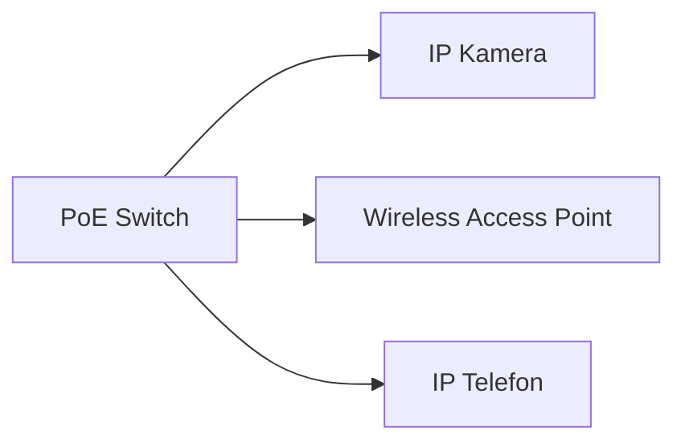

---
# Identity (stable; never change after publishing)
id: ap1-0181
slug: "power-over-ethernet-poe"

# Display
title: "Power over Ethernet (PoE)"

# Classification / navigation (machine-side)
module: "Beurteilen marktgängiger IT-Systeme und Lösungen"
topics: ["Netzwerktechnik", "Ethernet", "Stromversorgung"]
tags: ["poe","ieee","infrastruktur"]

# Flashcard payload
card:
  type: definition
  question: "Was bezeichnet man in der Netzwerktechnologie als PoE?"
  answer: "Power over Ethernet (PoE) bezeichnet ein Verfahren, bei dem Netzwerkgeräte über das Ethernet-Kabel gleichzeitig mit Daten und Strom versorgt werden."
  examples:
    - "IP-Telefone"
    - "Wireless Access Points (WAP)"
    - "IP-Kameras"
    - "Zeiterfassungsterminals"

# Lifecycle
status: published
created: "2026-03-14"
updated: "2026-03-16"
---

<!-- Optional: extra explanation, diagrams, tables, links, etc.
     Keep the "answer" concise; put longer context here if useful. -->

## Power over Ethernet (PoE)

**Power over Ethernet (PoE)** ist eine Technologie, mit der **Netzwerkgeräte über ein Ethernet-Kabel sowohl Daten als auch elektrische Energie erhalten**.

Dadurch kann auf separate Netzteile oder Stromleitungen verzichtet werden.

Typische Einsatzbereiche sind Geräte, die häufig **an schwer zugänglichen Orten** installiert werden.

---

## Kernerklärung

PoE wird durch verschiedene **IEEE-Standards** definiert.

| Standard | Bezeichnung | Beschreibung |
|---|---|---|
| IEEE 802.3af | PoE | Grundstandard für Stromversorgung über Ethernet |
| IEEE 802.3at | PoE+ | Höhere Leistung für leistungsstärkere Geräte |
| IEEE 802.3bt | 4PPoE | Versorgung über alle vier Adernpaare |
| IEEE 802.3bu | PoDL | Power over Data Lines |

PoE ermöglicht:

- **Stromversorgung über Netzwerkkabel**
- **Zentrale Stromverteilung über Switches**
- **Einfachere Installation von Netzwerkgeräten**

---

## Praktisches Beispiel

Ein Unternehmen installiert mehrere **IP-Kameras** in einem Gebäude.

Statt jede Kamera mit einem separaten Netzteil zu versorgen:

1. Die Kameras werden über **Ethernet-Kabel** mit einem **PoE-Switch** verbunden.
2. Der Switch liefert **Daten + Strom gleichzeitig**.
3. Dadurch sind **keine zusätzlichen Stromleitungen** nötig.

---

## Prüfungsrelevanz (AP1)

### Typische Prüfungsfragen

- Was bedeutet **PoE**?
- Welche Vorteile bietet **Power over Ethernet**?
- Welche Geräte werden typischerweise mit **PoE** betrieben?
- Welche **IEEE-Standards** definieren PoE?

### Antworten auf die typischen Prüfungsfragen

**Definition**

PoE ermöglicht die **Stromversorgung von Netzwerkgeräten über Ethernet-Kabel**.

**Vorteile**

- weniger Kabel
- zentrale Stromversorgung
- einfachere Installation
- geringere Infrastrukturkosten

**Typische Geräte**

- IP-Telefone  
- Wireless Access Points  
- IP-Kameras  
- Zeiterfassungssysteme  

**Standards**

IEEE **802.3af**, **802.3at**, **802.3bt**, **802.3bu**

---

## Merksatz

> PoE bedeutet: **Daten und Strom über dasselbe Ethernet-Kabel übertragen.**