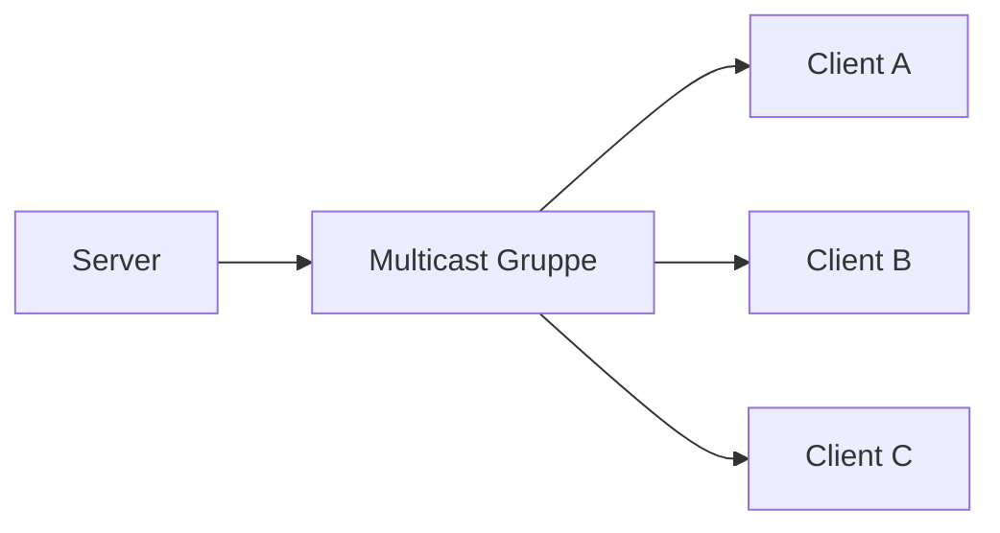

---
# Identity (stable; never change after publishing)
id: ap1-0185
slug: "multicast-netzwerkkommunikation"

# Display
title: "Multicast in der Netzwerkkommunikation"

# Classification / navigation (machine-side)
module: "Beurteilen marktgängiger IT-Systeme und Lösungen"
topics: ["Netzwerktechnik", "Kommunikationsarten", "IP-Netzwerke"]
tags: ["multicast","netzwerkkommunikation","ip"]

# Flashcard payload
card:
  type: basic
  question: "Was bezeichnet man in IPv6-Netzwerken als Multicast und wie wird er zur MAC-Adressauflösung genutzt?"
  answer: "Multicast bezeichnet eine Netzwerkkommunikation, bei der ein Sender Daten gleichzeitig an eine definierte Gruppe von Empfängern überträgt."
  examples:
    - "IPv6 Neighbor Discovery verwendet Multicast zur Adressauflösung."
    - "Streaming-Dienste können Multicast verwenden, um Daten gleichzeitig an mehrere Empfänger zu senden."

# Lifecycle
status: published
created: "2026-03-14"
updated: "2026-03-16"
---

<!-- Optional: extra explanation, diagrams, tables, links, etc.
     Keep the "answer" concise; put longer context here if useful. -->

## Multicast in der Netzwerkkommunikation

**Multicast** ist eine Form der Netzwerkkommunikation, bei der ein **Sender Daten gleichzeitig an eine bestimmte Gruppe von Empfängern** überträgt.

Im Gegensatz zu **Unicast** (ein Empfänger) und **Broadcast** (alle Geräte) werden Daten **nur an ausgewählte Teilnehmer einer Gruppe** gesendet.

Diese Methode reduziert unnötigen Netzwerkverkehr und wird häufig bei **IPv6 und Streaming-Anwendungen** verwendet.

---

## Kernerklärung

Eigenschaften von Multicast:

- **Ein Sender → mehrere definierte Empfänger**
- Empfänger müssen **Mitglied einer Multicast-Gruppe** sein
- Andere Geräte im Netzwerk **ignorieren die Daten**

Besonders in **IPv6-Netzwerken** wird Multicast verwendet, um Funktionen zu ersetzen, die in IPv4 über Broadcast liefen.

Beispiel:  
**Neighbor Discovery Protocol (NDP)** nutzt Multicast, um **MAC-Adressen zu ermitteln**.

---

## Praktisches Beispiel

Ein Server sendet einen Datenstrom an mehrere Clients gleichzeitig.

Nur Geräte, die **Mitglied der Multicast-Gruppe** sind, erhalten die Daten.

---

## Prüfungsrelevanz (AP1)

### Typische Prüfungsfragen

- Was bedeutet **Multicast**?
- Wie unterscheidet sich Multicast von **Unicast** und **Broadcast**?
- Wofür wird Multicast in **IPv6-Netzwerken** verwendet?

### Antworten auf die typischen Prüfungsfragen

**Definition**

Multicast ist eine Kommunikationsform, bei der **ein Sender Daten gleichzeitig an eine definierte Empfängergruppe sendet**.

**Unterschiede**

| Kommunikationsart | Empfänger |
|---|---|
| Unicast | genau ein Empfänger |
| Multicast | mehrere ausgewählte Empfänger |
| Broadcast | alle Geräte im Netzwerk |

**IPv6 Einsatz**

IPv6 nutzt Multicast z. B. für **Neighbor Discovery zur MAC-Adressauflösung**.

---

## Merksatz

> **Multicast = 1 Sender → ausgewählte Empfängergruppe**