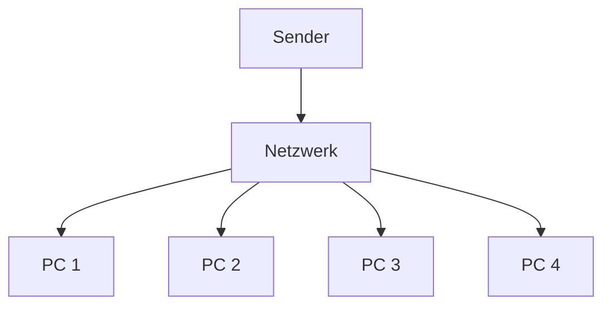

---
# Identity (stable; never change after publishing)
id: ap1-0186
slug: "broadcast-netzwerkkommunikation"

# Display
title: "Broadcast in der Netzwerkkommunikation"

# Classification / navigation (machine-side)
module: "Beurteilen marktgängiger IT-Systeme und Lösungen"
topics: ["Netzwerktechnik", "Kommunikationsarten", "IP-Netzwerke"]
tags: ["broadcast","netzwerkkommunikation","ip"]

# Flashcard payload
card:
  type: basic
  question: "Was versteht man in IPv4-Netzwerken unter dem Begriff Broadcast?"
  answer: "Broadcast bezeichnet eine Netzwerkkommunikation, bei der ein Sender Daten gleichzeitig an alle Geräte eines Netzwerks oder Subnetzes sendet."
  examples:
    - "ARP-Anfragen in IPv4-Netzwerken"
    - "DHCP Discover Nachricht beim Beziehen einer IP-Adresse"
    - "Netzwerkgeräte suchen andere Geräte im selben Subnetz"

# Lifecycle
status: published
created: "2026-03-14"
updated: "2026-03-16"
---

<!-- Optional: extra explanation, diagrams, tables, links, etc.
     Keep the "answer" concise; put longer context here if useful. -->

## Broadcast in der Netzwerkkommunikation

**Broadcast** ist eine Kommunikationsform im Netzwerk, bei der **ein Sender seine Daten gleichzeitig an alle Geräte innerhalb eines Netzwerks oder Subnetzes sendet**.

Alle Geräte im Netzwerk empfangen diese Datenpakete – unabhängig davon, ob sie für sie relevant sind oder nicht.

Deshalb versucht man in **IPv4-Netzwerken Broadcast möglichst zu reduzieren**, da er unnötigen Netzwerkverkehr erzeugen kann.

---

## Kernerklärung

Beim Broadcast werden Daten **an alle Teilnehmer eines Netzwerks verteilt**.

Eigenschaften:

- **Ein Sender → alle Empfänger im Netzwerk**
- Zieladresse ist eine **Broadcast-Adresse**
- Alle Geräte müssen das Paket **empfangen und prüfen**

Das führt zu zusätzlicher Last im Netzwerk, weshalb große Netzwerke häufig in **Subnetze (Broadcast-Domänen)** aufgeteilt werden.

---

## Praktisches Beispiel

Ein Gerät sucht einen anderen Rechner im Netzwerk und sendet eine Anfrage an alle Geräte.

Alle Geräte erhalten die Nachricht, aber **nur das passende Gerät antwortet**.

Typische Broadcast-Protokolle:

- **ARP (Address Resolution Protocol)**
- **DHCP Discover**

---

## Prüfungsrelevanz (AP1)

### Typische Prüfungsfragen

- Was versteht man unter **Broadcast**?
- Warum versucht man Broadcast in Netzwerken zu **reduzieren**?
- Welche bekannten Protokolle nutzen Broadcast?

### Antworten auf die typischen Prüfungsfragen

**Definition**

Broadcast ist eine Kommunikationsform, bei der **ein Sender Daten an alle Geräte innerhalb eines Netzwerks oder Subnetzes sendet**.

**Warum minimieren?**

Weil **alle Geräte die Pakete verarbeiten müssen**, was zu unnötiger Netzwerklast führt.

**Typische Beispiele**

- ARP
- DHCP Discover

---

## Merksatz

> **Broadcast = 1 Sender → alle Geräte im Netzwerk**