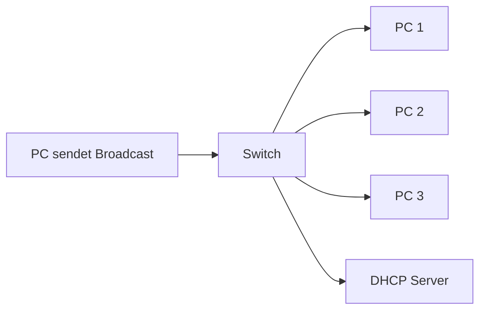

---
# Identity (stable; never change after publishing)
id: ap1-0187
slug: ipv4-broadcast-adresse-aufgabe

# Display
title: "Aufgabe einer IPv4 Broadcast-Adresse"

# Classification / navigation (machine-side)
module: "Beurteilen marktgängiger IT-Systeme und Lösungen"
topics: ["ipv4", "adressierung", "subnetze"]
tags: ["broadcast", "ipv4", "netzwerkgrundlagen", "subnetz"]

# Flashcard payload
card:
  type: basic
  question: "Wofür dient eine Broadcast-Adresse in IPv4-Netzwerken?"
  answer: "Eine Broadcast-Adresse ermöglicht das Senden eines Pakets an alle Geräte innerhalb eines lokalen Netzwerks. Sie ist die letzte IP-Adresse eines Subnetzes und wird nicht über Router weitergeleitet."
  examples: []

# Lifecycle
status: published
created: "2026-03-14"
updated: "2026-03-16"
---

## Aufgabe einer IPv4 Broadcast-Adresse

Eine **Broadcast-Adresse** in IPv4 dient dazu, **eine Nachricht gleichzeitig an alle Geräte eines lokalen Netzwerks zu senden**.  
Statt einzelne Geräte gezielt anzusprechen, erreicht ein Broadcast **alle Hosts innerhalb desselben Subnetzes**.

Wichtige Eigenschaften:

- gilt **nur innerhalb eines lokalen Netzwerks**
- wird **nicht von Routern weitergeleitet**
- ist **immer die letzte IP-Adresse eines Subnetzes**

---

## Kernerklärung

In IPv4 besteht ein Netzwerk aus:

- **Netzwerkadresse**
- **Hostadressen**
- **Broadcast-Adresse**

Die Broadcast-Adresse wird verwendet, wenn ein Gerät **alle Geräte im Netzwerk gleichzeitig erreichen möchte**.

Typische Szenarien:

- Geräte suchen nach einem **DHCP-Server**
- **ARP-Anfragen**
- Netzwerkdienste erkennen verfügbare Geräte

Die Broadcast-Adresse entsteht, wenn **alle Hostbits im Subnetz auf 1 gesetzt werden**.

Beispiel:

| Typ | Adresse |
|---|---|
| Netzwerkadresse | 192.168.1.0 |
| Hostbereich | 192.168.1.1 – 192.168.1.254 |
| Broadcast-Adresse | 192.168.1.255 |

---

## Praktisches Beispiel

Ein Computer im Netzwerk **192.168.1.0/24** sucht einen DHCP-Server.

Er sendet eine Nachricht an:

```
255.255.255.255
```

oder

```
192.168.1.255
```

Alle Geräte im Netzwerk empfangen diese Nachricht.



Der **Router leitet diese Nachricht nicht in andere Netzwerke weiter**.

---

## Prüfungsrelevanz (AP1)

Diese Frage gehört zu den **klassischen Grundlagen der IPv4-Adressierung**.

Prüfungen testen häufig:

- Funktion der Broadcast-Adresse
- Position der Broadcast-Adresse im Subnetz
- Unterschied zwischen **Unicast / Broadcast / Multicast**

---

### Typische Prüfungsfragen

- Welche Aufgabe hat eine Broadcast-Adresse?
- Wo befindet sich die Broadcast-Adresse in einem Subnetz?
- Wird eine Broadcast-Adresse über Router weitergeleitet?

---

### Antworten auf die typischen Prüfungsfragen

**Welche Aufgabe hat eine Broadcast-Adresse?**  
→ Nachricht an **alle Geräte eines lokalen Netzwerks senden**

**Wo liegt die Broadcast-Adresse?**  
→ **Letzte IP-Adresse eines Subnetzes**

**Wird sie über Router weitergeleitet?**  
→ **Nein**, Broadcasts bleiben im lokalen Netzwerk.

---

## Merksatz

**Die Broadcast-Adresse ist immer die letzte Adresse eines Subnetzes und erreicht alle Geräte im lokalen Netzwerk.**