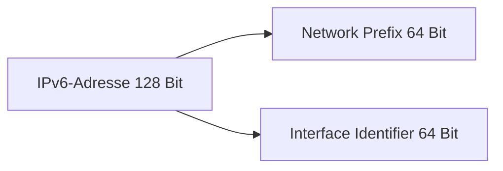

---
# Identity (stable; never change after publishing)
id: ap1-0188
slug: ipv6-adresse-bestandteile

# Display
title: "Bestandteile einer IPv6-Adresse"

# Classification / navigation (machine-side)
module: "Beurteilen marktgängiger IT-Systeme und Lösungen
topics: ["ipv6", "adressierung"]
tags: ["ipv6", "netzwerkgrundlagen", "adressstruktur"]

# Flashcard payload
card:
  type: basic
  question: "Beschreibe die Bestandteile einer IPv6-Adresse."
  answer: "Eine IPv6-Adresse ist 128 Bit lang und besteht aus zwei Teilen: dem Network Prefix (Netzwerkpräfix) und dem Interface Identifier (Netzwerkschnittstelle). Die Adresse wird hexadezimal dargestellt und durch Doppelpunkte getrennt."
  examples: []

# Lifecycle
status: published
created: "2026-03-14"
updated: "2026-03-16"
---

## Bestandteile einer IPv6-Adresse

Eine **IPv6-Adresse** identifiziert eindeutig ein Gerät in einem IPv6-Netzwerk.  

Sie ist **128 Bit lang** und wird in **hexadezimaler Schreibweise** dargestellt.

Eine IPv6-Adresse besteht aus zwei Hauptbestandteilen:

- **Network Prefix** → beschreibt das Netzwerk
- **Interface Identifier** → identifiziert das Gerät innerhalb des Netzwerks

---

## Kernerklärung

IPv6-Adressen bestehen aus **128 Bit**, die in **acht Gruppen zu je 16 Bit** unterteilt sind.  
Diese Gruppen werden **hexadezimal dargestellt** und durch **Doppelpunkte (`:`)** getrennt.

Beispieladresse:

```
2003:00dc:75a:dd00:e130:c353:3188:afb6
```

Struktur:

| Teil | Beschreibung |
|---|---|
| Network Prefix | Bestimmt das Netzwerk (ähnlich der Netz-ID bei IPv4) |
| Interface Identifier | Identifiziert das Gerät im Netzwerk |

Typische Aufteilung:

| Bereich | Größe |
|---|---|
| Network Prefix | 64 Bit |
| Interface Identifier | 64 Bit |

Damit ergibt sich die vollständige Länge von **128 Bit**.



---

## Praktisches Beispiel

Beispiel IPv6-Adresse:

```
2003:00dc:75a:dd00:e130:c353:3188:afb6
```

Aufteilung:

| Teil | Beispiel |
|---|---|
| Network Prefix | 2003:00dc:75a:dd00 |
| Interface Identifier | e130:c353:3188:afb6 |

Der **Network Prefix** bestimmt das Netzwerk, während der **Interface Identifier** das konkrete Gerät beschreibt.

---

## Prüfungsrelevanz (AP1)

IPv6-Grundlagen gehören zu den **typischen Themen in der AP1**.

Besonders häufig geprüft werden:

- Länge einer IPv6-Adresse
- Darstellung in **Hexadezimal**
- Bestandteile der Adresse
- Unterschied zu **IPv4**

---

### Typische Prüfungsfragen

- Wie lang ist eine IPv6-Adresse?
- Aus welchen Bestandteilen besteht eine IPv6-Adresse?
- Wie wird eine IPv6-Adresse dargestellt?

---

### Antworten auf die typischen Prüfungsfragen

**Wie lang ist eine IPv6-Adresse?**  
→ **128 Bit**

**Aus welchen Bestandteilen besteht sie?**  
→ **Network Prefix** und **Interface Identifier**

**Wie wird sie dargestellt?**  
→ **Hexadezimal in acht 16-Bit-Blöcken, getrennt durch Doppelpunkte**

---

## Merksatz

**IPv6-Adressen sind 128 Bit lang und bestehen aus Network Prefix (Netzwerk) und Interface Identifier (Gerät).**