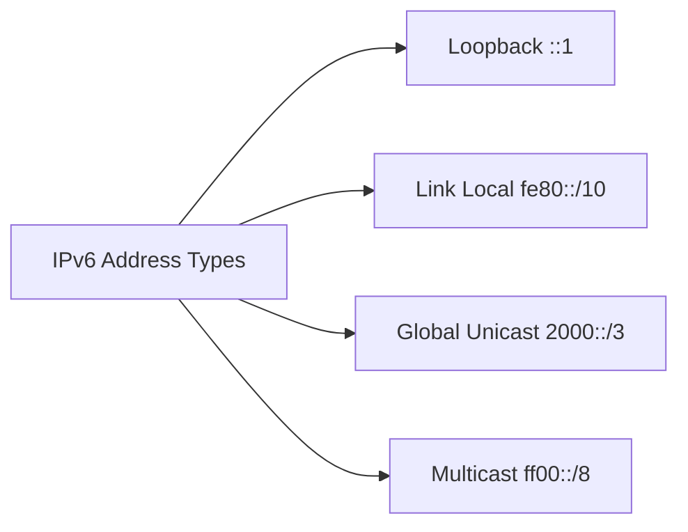

---
# Identity (stable; never change after publishing)
id: ap1-0190
slug: ipv6-adresstypen-ueberblick

# Display
title: "IPv6-Adresstypen und ihre Bereiche"

# Classification / navigation (machine-side)
module: "Beurteilen marktgängiger IT-Systeme und Lösungen"
topics: ["ipv6", "adressierung"]
tags: ["ipv6", "adressbereiche", "loopback", "multicast", "link-local"]

# Flashcard payload
card:
  type: basic
  question: "Benenne die IPv6-Adressbereiche (IPv6-Address-Types)."
  answer: "::1/128 → Loopback, fe80::/10 → Link-Local Addresses, 2000::/3 → Global Unicast, ff00::/8 → Multicast."
  examples: []

# Lifecycle
status: published
created: "2026-03-14"
updated: "2026-03-16"
---

## IPv6-Adresstypen und ihre Bereiche

IPv6 verwendet verschiedene **Adressbereiche (Address Types)**, um unterschiedliche Kommunikationsarten im Netzwerk zu ermöglichen.

Diese definieren:

- **wo eine Adresse gültig ist**
- **wie sie verwendet wird**
- **welche Geräte sie erreichen können**

Die wichtigsten IPv6-Adresstypen sind:

- **Loopback**
- **Link-Local**
- **Global Unicast**
- **Multicast**

---

## Kernerklärung

Die Adresstypen lassen sich anhand ihres **Adresspräfixes** erkennen.

| Präfix | Adresstyp | Beschreibung |
|---|---|---|
| `::1/128` | Loopback | Adresse für interne Kommunikation eines Geräts |
| `fe80::/10` | Link-Local | Kommunikation innerhalb desselben lokalen Netzsegments |
| `2000::/3` | Global Unicast | Öffentlich routbare IPv6-Adresse im Internet |
| `ff00::/8` | Multicast | Nachricht an eine Gruppe von Geräten |

### Eigenschaften der Adresstypen

- **Loopback**  
  - vergleichbar mit `127.0.0.1` in IPv4  
  - wird nur lokal auf dem eigenen Gerät verwendet

- **Link-Local**  
  - automatisch generiert  
  - funktioniert nur innerhalb eines lokalen Netzsegments  
  - Router leiten diese Adressen **nicht weiter**

- **Global Unicast**  
  - entspricht einer **öffentlichen IPv4-Adresse**  
  - weltweit eindeutig und routbar

- **Multicast**  
  - sendet Daten an **eine Gruppe von Geräten**  
  - ersetzt Broadcast aus IPv4

---

## Praktisches Beispiel

Ein Computer kann gleichzeitig mehrere IPv6-Adressen besitzen:

| Beispieladresse | Typ | Zweck |
|---|---|---|
| `::1` | Loopback | Test der eigenen Netzwerkschnittstelle |
| `fe80::1a2b:3c4d` | Link-Local | Kommunikation im lokalen Netzwerk |
| `2001:db8::1` | Global Unicast | Kommunikation im Internet |
| `ff02::1` | Multicast | Nachricht an alle Hosts im Netzwerk |

---

## Prüfungsrelevanz (AP1)

IPv6-Adresstypen gehören zu den **Standardfragen der AP1**.

Häufige Prüfungsaufgaben:

- Präfix → **Adressart erkennen**
- Unterschiede zwischen **Link-Local und Global Unicast**
- Vergleich zu **IPv4 (Broadcast vs Multicast)**

---

### Typische Prüfungsfragen

- Welche IPv6-Adresse wird für Loopback verwendet?
- Welcher Bereich gehört zu Link-Local-Adressen?
- Welche IPv6-Adressen sind global routbar?
- Welcher Bereich wird für Multicast verwendet?

---

### Antworten auf die typischen Prüfungsfragen

**Loopback-Adresse?**  
→ `::1/128`

**Link-Local Bereich?**  
→ `fe80::/10`

**Globale IPv6-Adressen?**  
→ `2000::/3`

**Multicast Bereich?**  
→ `ff00::/8`

---

## Merksatz

**IPv6 kennt vier wichtige Adresstypen: Loopback (::1), Link-Local (fe80::), Global Unicast (2000::) und Multicast (ff00::).**