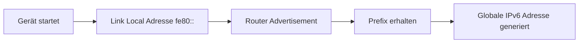

---
# Identity (stable; never change after publishing)
id: ap1-0191
slug: ipv6-slaac-autokonfiguration

# Display
title: "IPv6 SLAAC (Stateless Address Autoconfiguration)"

# Classification / navigation (machine-side)
module: "Beurteilen marktgängiger IT-Systeme und Lösungen"
topics: ["ipv6", "adressierung", "autokonfiguration"]
tags: ["ipv6", "slaac", "link-local", "autokonfiguration"]

# Flashcard payload
card:
  type: basic
  question: "Wie funktioniert die Stateless Address Autoconfiguration bei IPv6?"
  answer: "SLAAC (Stateless Address Autoconfiguration) ist die automatische IPv6-Adresskonfiguration ohne zentralen Server. Jedes Gerät erhält automatisch eine Link-Local-Adresse (beginnend mit fe80::) und kann daraus eine gültige IPv6-Adresse erzeugen."
  examples: []

# Lifecycle
status: published
created: "2026-03-14"
updated: "2026-03-16"
---

## IPv6 SLAAC (Stateless Address Autoconfiguration)

**SLAAC (Stateless Address Autoconfiguration)** ist ein Mechanismus von IPv6, mit dem Geräte **automatisch eine IP-Adresse konfigurieren können**, ohne dass ein DHCP-Server erforderlich ist.

Dabei erzeugt jedes Gerät selbstständig eine **Link-Local-Adresse**, die mit **`fe80::`** beginnt.

---

## Kernerklärung

Bei IPv6 besitzt jedes Gerät mit aktiviertem IPv6-Stack automatisch die Fähigkeit zur **Selbstkonfiguration**.

Der Ablauf:

1. Das Gerät erzeugt automatisch eine **Link-Local-Adresse (`fe80::/10`)**.
2. Das Gerät prüft mittels **Duplicate Address Detection (DAD)**, ob die Adresse bereits existiert.
3. Router im Netzwerk senden **Router Advertisements (RA)**.
4. Das Gerät kombiniert:
   - das **Network Prefix** aus dem Router Advertisement
   - seinen **Interface Identifier**

So entsteht automatisch eine **gültige globale IPv6-Adresse**.

Wichtig:

| Eigenschaft | Beschreibung |
|---|---|
| Stateless | Es wird **kein zentraler Zustand (Server)** gespeichert |
| Automatisch | Geräte konfigurieren sich selbst |
| Link-Local | beginnt immer mit **fe80::** |

---

## Praktisches Beispiel

Ein Gerät wird in ein IPv6-Netzwerk eingesteckt.

1. Es erzeugt automatisch eine Adresse wie:

```
fe80::2a3b:4c5d:6e7f:1234
```

2. Der Router sendet ein Prefix:

```
2001:db8:abcd:1::/64
```

3. Das Gerät kombiniert beides zu einer globalen Adresse:

```
2001:db8:abcd:1:2a3b:4c5d:6e7f:1234
```



---

## Prüfungsrelevanz (AP1)

SLAAC gehört zu den **IPv6-Grundkonzepten**, die regelmäßig in der **AP1** abgefragt werden.

Typische Inhalte:

- Bedeutung von **Stateless**
- Zusammenhang mit **Link-Local-Adressen**
- Unterschied zu **DHCPv6**

---

### Typische Prüfungsfragen

- Was bedeutet SLAAC?
- Welche Adresse erhält jedes IPv6-Gerät automatisch?
- Mit welchem Präfix beginnen Link-Local-Adressen?

---

### Antworten auf die typischen Prüfungsfragen

**Was bedeutet SLAAC?**  
→ Automatische IPv6-Adresskonfiguration **ohne DHCP-Server**.

**Welche Adresse erhält jedes Gerät automatisch?**  
→ Eine **Link-Local-Adresse**.

**Mit welchem Präfix beginnen Link-Local-Adressen?**  
→ **`fe80::`**

---

## Merksatz

**IPv6 kann sich selbst konfigurieren: Mit SLAAC erhält jedes Gerät automatisch eine Link-Local-Adresse (fe80::) und kann daraus eine globale Adresse bilden.**