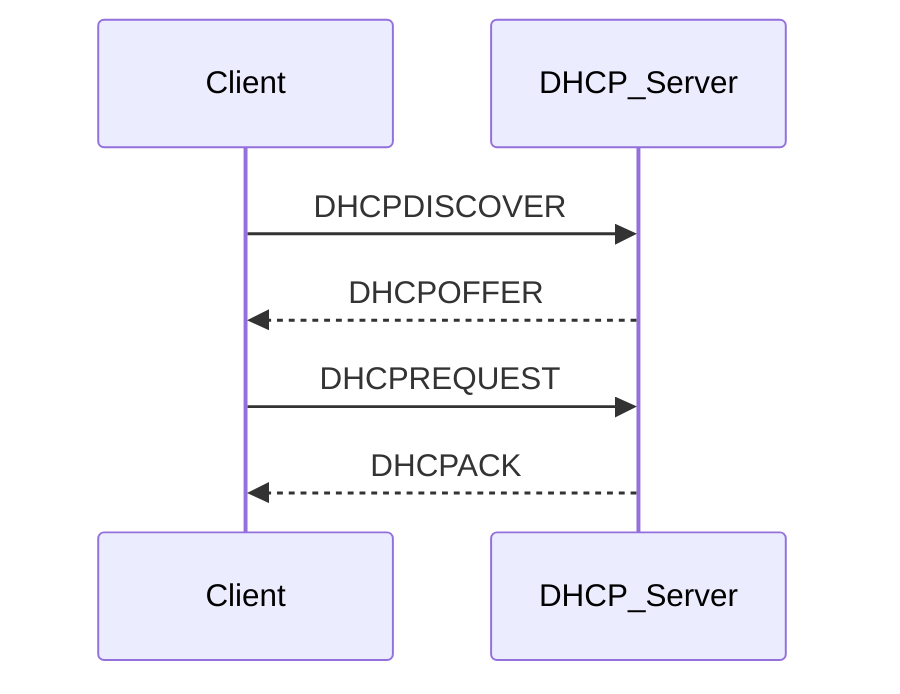

---
# Identity (stable; never change after publishing)
id: ap1-0196
slug: dhcp-aufgaben-und-funktion

# Display
title: "DHCP – Aufgaben und Funktion"

# Classification / navigation (machine-side)
module: "Beurteilen marktgängiger IT-Systeme und Lösungen"
topics: ["netzwerkmanagement", "protokolle", "adressierung"]
tags: ["dhcp", "ip-adressen", "netzwerkdienste"]

# Flashcard payload
card:
  type: basic
  question: "Welche Aufgaben hat ein DHCP-Server innerhalb der IT-Infrastruktur?"
  answer: "Ein DHCP-Server weist Geräten automatisch IP-Adressen und Netzwerkkonfigurationen zu (z. B. Subnetzmaske, Gateway, DNS). Er verwaltet Adressbereiche und vergibt diese dynamisch über einen definierten Zeitraum (Lease)."
  examples: []

# Lifecycle
status: published
created: "2026-03-17"
updated: "2026-03-17"
---

## DHCP – Aufgaben und Funktion

Der **DHCP-Server (Dynamic Host Configuration Protocol)** sorgt dafür, dass Geräte im Netzwerk **automatisch konfiguriert werden**.

Ohne DHCP müssten IP-Adressen und weitere Netzwerkeinstellungen **manuell vergeben werden**.

---

## Kernerklärung

Ein DHCP-Server übernimmt die **zentrale Verwaltung von IP-Adressen und Netzwerkkonfigurationen**.

### Hauptaufgaben

- automatische Vergabe von:
  - **IP-Adresse**
  - **Subnetzmaske**
  - **Standard-Gateway**
  - **DNS-Server**
- Verwaltung von **Adressbereichen (Pools)**
- Vergabe von Adressen auf Zeit (**Lease-Time**)
- Vermeidung von **Adresskonflikten**

### Erweiterte Optionen

Ein DHCP-Server kann zusätzlich bereitstellen:

- **DNS-Domain / DNS-Suffix**
- **NTP-Server (Zeitserver)**
- **WINS-Server (ältere Windows-Netze)**
- **Proxy-Konfiguration (WPAD)**
- **PXE-Boot-Informationen**

### Ablauf (vereinfacht)

---

## Praktisches Beispiel

Ein Laptop wird mit dem Netzwerk verbunden:

1. Sendet eine **Broadcast-Anfrage (DHCPDISCOVER)**
2. DHCP-Server antwortet mit einer freien IP-Adresse
3. Laptop übernimmt automatisch:
   - IP-Adresse (z. B. 192.168.1.100)
   - Gateway
   - DNS-Server

→ Das Gerät ist **sofort betriebsbereit**, ohne manuelle Konfiguration.

---

## Prüfungsrelevanz (AP1)

DHCP ist ein **zentrales Grundlagen-Thema**.

Typische Prüfungsinhalte:

- Aufgaben eines DHCP-Servers
- Unterschied **statisch vs. dynamisch**
- DHCP-Ablauf (DORA-Prinzip)
- typische Konfigurationsparameter

---

### Typische Prüfungsfragen

- Welche Informationen liefert ein DHCP-Server?
- Was bedeutet Lease-Time?
- Wie läuft die DHCP-Kommunikation ab?

---

### Antworten auf die typischen Prüfungsfragen

**Welche Informationen liefert DHCP?**  
→ IP-Adresse, Subnetzmaske, Gateway, DNS u. a.

**Was ist die Lease-Time?**  
→ Zeitraum, für den eine IP-Adresse vergeben wird

**Wie läuft DHCP ab?**  
→ DISCOVER → OFFER → REQUEST → ACK (DORA)

---

## Merksatz

**DHCP = automatische Vergabe von IP-Adressen und Netzwerkeinstellungen im Netzwerk.**