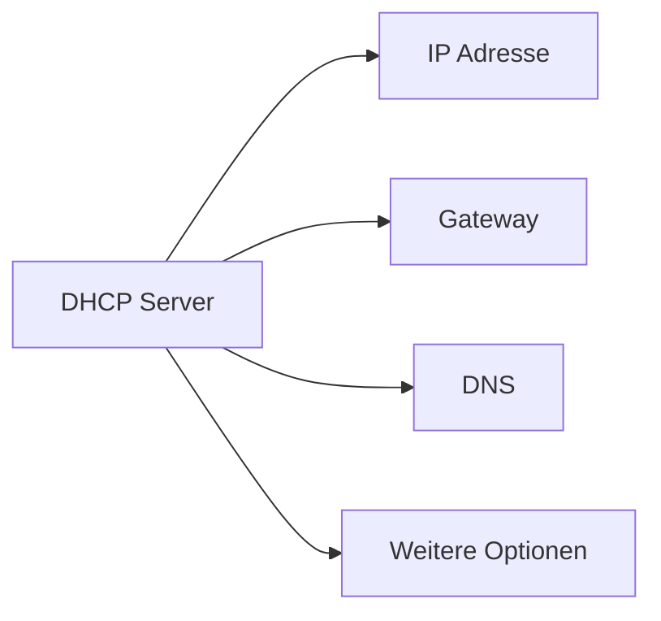

---
# Identity (stable; never change after publishing)
id: ap1-0197
slug: dhcp-bereitgestellte-informationen

# Display
title: "DHCP – bereitgestellte Informationen"

# Classification / navigation (machine-side)
module: "Beurteilen marktgängiger IT-Systeme und Lösungen"
topics: ["netzwerkmanagement", "dhcp", "adressierung"]
tags: ["dhcp", "netzwerkkonfiguration", "ip-adressen"]

# Flashcard payload
card:
  type: basic
  question: "Welche Informationen stellt der DHCP-Dienst (Dynamic Host Configuration Protocol) zur Verfügung?"
  answer: "DHCP stellt automatisch Netzwerkinformationen bereit wie IP-Adresse, Subnetzmaske, Standard-Gateway, DNS-Server sowie weitere Optionen wie Lease-Time, NTP-Server, Domain-Name oder PXE-Boot-Informationen."
  examples: []

# Lifecycle
status: published
created: "2026-03-17"
updated: "2026-03-17"
---

## DHCP – bereitgestellte Informationen

Der **DHCP-Dienst** stellt Geräten im Netzwerk **alle notwendigen Konfigurationsdaten automatisch zur Verfügung**, damit diese sofort kommunizieren können.

Neben den Grunddaten können auch **erweiterte Optionen** verteilt werden.

---

## Kernerklärung

Ein DHCP-Server liefert verschiedene Arten von Informationen:

### Grundlegende Netzwerkparameter

| Parameter | Beschreibung |
|---|---|
| IP-Adresse | eindeutige Adresse im Netzwerk |
| Subnetzmaske | definiert den Netzwerkbereich |
| Standard-Gateway | Router für externe Netzwerke |
| DNS-Server | Namensauflösung (Domain → IP) |

### Erweiterte DHCP-Optionen

| Option | Zweck |
|---|---|
| Lease-Time | Gültigkeitsdauer der IP-Adresse |
| DNS-Domain | Domänenname des Netzwerks |
| NTP-Server | Zeitsynchronisation |
| WINS-Server | Namensauflösung (ältere Windows-Netze) |
| Proxy (WPAD) | automatische Proxy-Konfiguration |
| PXE-Boot | Netzwerkstart von Geräten |

---

## Praktisches Beispiel

Ein neuer PC wird ins Netzwerk eingebunden:

- erhält automatisch:
  - IP-Adresse: `192.168.1.50`
  - Subnetzmaske: `255.255.255.0`
  - Gateway: `192.168.1.1`
  - DNS: `192.168.1.10`
- zusätzlich:
  - Domain: `firma.local`
  - NTP-Server für Uhrzeit

→ Der PC ist sofort **voll funktionsfähig**.

---

## Prüfungsrelevanz (AP1)

Sehr häufig geprüft:

- Welche Informationen liefert DHCP?
- Unterschied **Basisparameter vs. Optionen**
- Zusammenhang mit **automatischer Netzwerkkonfiguration**

---

### Typische Prüfungsfragen

- Welche Basisdaten stellt DHCP bereit?
- Was ist die Lease-Time?
- Nenne Beispiele für DHCP-Optionen.

---

### Antworten auf die typischen Prüfungsfragen

**Welche Basisdaten liefert DHCP?**  
→ IP-Adresse, Subnetzmaske, Gateway, DNS

**Was ist die Lease-Time?**  
→ Zeitraum, für den eine IP-Adresse gültig ist

**Beispiele für Optionen?**  
→ NTP, Domain-Name, PXE-Boot, Proxy

---

## Merksatz

**DHCP liefert alles, was ein Gerät zum Netzwerken braucht – automatisch.**