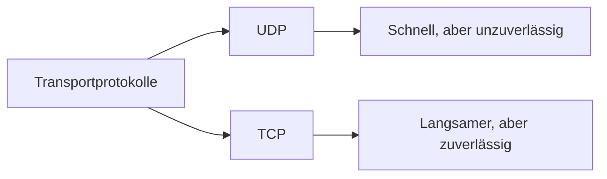

---
# Identity (stable; never change after publishing)
id: ap1-0198
slug: udp-vs-tcp-vergleich

# Display
title: "UDP vs. TCP – Vergleich der Protokolle"

# Classification / navigation (machine-side)
module: "Beurteilen marktgängiger IT-Systeme und Lösungen"
topics: ["protokolle", "transportprotokolle"]
tags: ["tcp", "udp", "vergleich", "netzwerkgrundlagen"]

# Flashcard payload
card:
  type: basic
  question: "Vergleiche die Protokolle UDP und TCP."
  answer: "UDP: kleiner Header (8 Byte), hohe Geschwindigkeit, keine Fehlerkontrolle oder Sicherung. TCP: größerer Header (20 Byte), langsamer, dafür zuverlässige Übertragung mit Fehlerkontrolle, Reihenfolge und Verbindungsüberwachung."
  examples: []

# Lifecycle
status: published
created: "2026-03-17"
updated: "2026-03-17"
---

## UDP vs. TCP – Vergleich der Protokolle

**UDP (User Datagram Protocol)** und **TCP (Transmission Control Protocol)** sind zwei zentrale **Transportprotokolle** im TCP/IP-Modell.

Sie unterscheiden sich hauptsächlich in:

- **Zuverlässigkeit**
- **Geschwindigkeit**
- **Funktionsumfang**

---

## Kernerklärung

### Vergleich UDP vs. TCP

| Eigenschaft | UDP | TCP |
|---|---|---|
| Headergröße | 8 Byte | 20 Byte |
| Geschwindigkeit | hoch | geringer |
| Paketverlusterkennung | nein | ja |
| Ende-zu-Ende-Kontrolle | nein | ja |
| Fehlerbehebung | nein | ja |
| Erkennung von Duplikaten | nein | ja |
| Flusskontrolle | nein | ja |
| Zeitüberwachung der Verbindung | nein | ja |

### Grundprinzip

- **UDP**
  - verbindungslos
  - keine Garantie für Zustellung
  - sehr schnell

- **TCP**
  - verbindungsorientiert
  - garantiert Reihenfolge und Zustellung
  - zuverlässiger, aber langsamer

---

## Praktisches Beispiel

| Anwendung | Protokoll | Grund |
|---|---|---|
| Video-Streaming | UDP | Geschwindigkeit wichtiger als Perfektion |
| Online-Gaming | UDP | geringe Latenz entscheidend |
| Web (HTTP/HTTPS) | TCP | zuverlässige Übertragung notwendig |
| Dateiübertragung (FTP) | TCP | keine Datenverluste erlaubt |

---

## Prüfungsrelevanz (AP1)

Sehr häufiges Thema:

- Unterschiede **UDP vs. TCP**
- Eigenschaften zuordnen (z. B. „welches Protokoll hat Fehlerkontrolle?“)
- typische Einsatzgebiete

---

### Typische Prüfungsfragen

- Welches Protokoll ist schneller: UDP oder TCP?
- Welches Protokoll garantiert die Zustellung?
- Welche Funktionen bietet TCP, die UDP nicht hat?

---

### Antworten auf die typischen Prüfungsfragen

**Welches ist schneller?**  
→ **UDP**

**Welches garantiert Zustellung?**  
→ **TCP**

**Welche Zusatzfunktionen hat TCP?**  
→ Fehlerkontrolle, Reihenfolge, Flusskontrolle, Verbindungsüberwachung

---

## Merksatz

**UDP = schnell, aber unsicher.  
TCP = langsam, aber zuverlässig.**