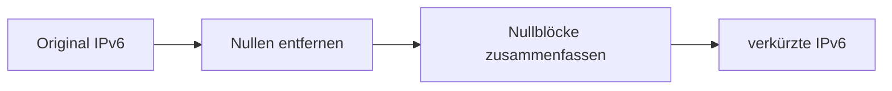

---
# Identity (stable; never change after publishing)
id: ap1-0199
slug: ipv6-verkuerzte-schreibweise

# Display
title: "IPv6 – verkürzte Schreibweise"

# Classification / navigation (machine-side)
module: "Beurteilen marktgängiger IT-Systeme und Lösungen"
topics: ["ipv6", "adressierung"]
tags: ["ipv6", "netzwerkgrundlagen", "adressnotation"]

# Flashcard payload
card:
  type: basic
  question: "Welche verkürzte Schreibweise der IPv6-Adresse 2001:0db8:0f3c:00d7:7dab:03d0:0000:00ff sind erlaubt?"
  answer: "Erlaubt sind nur Kürzungen durch Weglassen führender Nullen und einmaliges Zusammenfassen von aufeinanderfolgenden 0-Blöcken (::). Korrekt: 2001:db8:f3c:d7:7dab:3d0:0:ff und 2001:db8:f3c:d7:7dab:3d0::ff."
  examples: []

# Lifecycle
status:  published
created: "2026-03-17"
updated: "2026-03-17"
---

## IPv6 – verkürzte Schreibweise

IPv6-Adressen sind sehr lang (128 Bit) und bestehen aus **8 Blöcken à 4 Hex-Zeichen**.

Um die Lesbarkeit zu verbessern, gibt es Regeln zur **verkürzten Schreibweise**.

---

## Kernerklärung

### Regeln zur Verkürzung

1. **Führende Nullen dürfen entfernt werden**
   - `0db8 → db8`
   - `00d7 → d7`

2. **Zusammenhängende Null-Blöcke dürfen ersetzt werden**
   - `0000:0000 → ::`
   - **Wichtig:** nur **einmal pro Adresse erlaubt**

3. **Einzelne 0-Blöcke bleiben erhalten**
   - `0000 → 0` (wenn nicht zusammengefasst)

---

### Bewertung der Antwortmöglichkeiten

| Variante | Bewertung | Grund |
|---|---|---|
| 2001:db8:f3c:d7:7dab:3d0:ff | ❌ | Block fehlt → Struktur falsch |
| 2001:db8:f3c:d7:7dab:3d0:0:ff | ✅ | korrekt gekürzt |
| 2001:db8:f3c:d7:7dab:3d0::ff | ✅ | Nullblock korrekt zusammengefasst |
| 2001:db8:0f3c:00d7:7dab:03d0:00ff | ❌ | keine korrekte vollständige Kürzung |

---

## Praktisches Beispiel

Original:
```
2001:0db8:0f3c:00d7:7dab:03d0:0000:00ff
```

Schrittweise Kürzung:

1. Führende Nullen entfernen  
→ `2001:db8:f3c:d7:7dab:3d0:0:ff`

2. Nullblock zusammenfassen  
→ `2001:db8:f3c:d7:7dab:3d0::ff`



---

## Prüfungsrelevanz (AP1)

Typische Aufgaben:

- „Welche Schreibweise ist korrekt?“
- Fehler erkennen (zu viele `::`, fehlende Blöcke)
- Regeln anwenden

---

### Typische Prüfungsfragen

- Wie darf eine IPv6-Adresse gekürzt werden?
- Wie oft darf `::` verwendet werden?
- Was passiert mit führenden Nullen?

---

### Antworten auf die typischen Prüfungsfragen

**Wie wird gekürzt?**  
→ führende Nullen entfernen, Nullblöcke zusammenfassen

**Wie oft darf `::` vorkommen?**  
→ genau **einmal**

**Was passiert mit führenden Nullen?**  
→ sie werden weggelassen

---

## Merksatz

**IPv6 kürzen: Nullen vorne weg, Nullblöcke einmal mit „::“ ersetzen.**