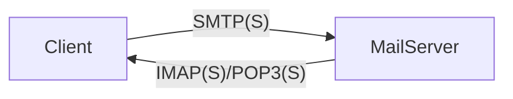

---
# Identity (stable; never change after publishing)
id: ap1-0204
slug: mailprotokolle-imaps-smtps-pop3s-vergleich

# Display
title: "Mailprotokolle – IMAPS, SMTPS und POP3S"

# Classification / navigation (machine-side)
module: "Beurteilen marktgängiger IT-Systeme und Lösungen"
topics: ["mailprotokolle", "anwendungsprotokolle"]
tags: ["smtp", "imap", "pop3", "tls", "email"]

# Flashcard payload
card:
  type: comparison
  question: "Wie unterscheiden sich die Mailprotokolle IMAPS, SMTPS und POP3S in ihren Eigenschaften?"
  answer: "SMTPS: Versand von E-Mails (Port 465, SSL/TLS). IMAPS: Zugriff und Synchronisation von Mails auf dem Server (Port 993, SSL/TLS). POP3S: Download von Mails vom Server (Port 995, SSL/TLS, meist lokale Speicherung)."
  examples: []

# Lifecycle
status: published
created: "2026-03-17"
updated: "2026-03-17"
---

## Mailprotokolle – IMAPS, SMTPS und POP3S

E-Mail-Kommunikation basiert auf verschiedenen Protokollen:

- **SMTP(S)** → Versand  
- **IMAP(S)** → Zugriff & Synchronisation  
- **POP3(S)** → Abruf & Download  

Die „S“-Varianten nutzen **SSL/TLS** für sichere Übertragung.

---

## Kernerklärung

### Vergleich der Mailprotokolle

| Protokoll | Aufgabe | Port | Besonderheit |
|---|---|---|---|
| SMTPS | Versand von E-Mails | 465 | Authentifizierung + verschlüsselte Übertragung |
| IMAPS | Zugriff auf Mails | 993 | Mails bleiben auf Server, Synchronisation |
| POP3S | Abruf von Mails | 995 | Mails werden heruntergeladen (oft lokal gespeichert) |

### Funktionsprinzip

- **SMTP(S)**: Client → Server (Senden)  
- **IMAP(S)/POP3(S)**: Server → Client (Empfangen)

---

## Praktisches Beispiel

- Du sendest eine Mail → **SMTP(S)**
- Du liest Mails auf mehreren Geräten → **IMAP(S)**
- Du lädst Mails lokal auf PC → **POP3(S)**

---

## Prüfungsrelevanz (AP1)

Sehr häufig geprüft:

- Unterschied **IMAP vs. POP3**
- Funktion von SMTP
- Standard-Ports und Einsatz

---

### Typische Prüfungsfragen

- Welches Protokoll wird zum Versenden von E-Mails genutzt?
- Unterschied IMAP und POP3?
- Welche Ports verwenden die sicheren Varianten?

---

### Antworten auf die typischen Prüfungsfragen

**Versand?**  
→ SMTP(S)  

**IMAP vs. POP3?**  
→ IMAP synchronisiert, POP3 lädt herunter  

**Ports?**  
→ 465 (SMTP), 993 (IMAP), 995 (POP3)  

---

## Merksatz

**SMTP sendet, IMAP synchronisiert, POP3 lädt herunter.**