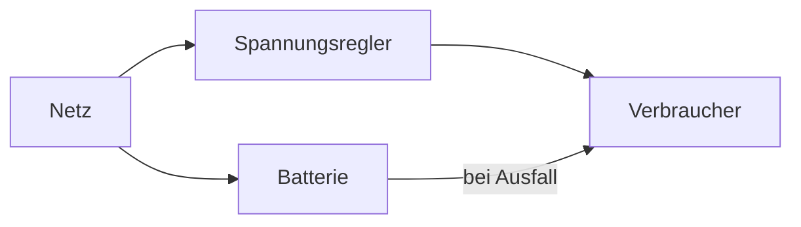

---
# Identity (stable; never change after publishing)
id: ap1-0208
slug: netzinteraktive-usv

# Display
title: "Netzinteraktive USV – Bedeutung"

# Classification / navigation (machine-side)
module: "Beurteilen marktgängiger IT-Systeme und Lösungen"
topics: ["stromversorgung", "usv"]
tags: ["usv", "line-interactive", "stromausfall"]

# Flashcard payload
card:
  type: definition
  question: "Was versteht man unter der Bezeichnung netzinteraktive USV?"
  answer: "Eine netzinteraktive USV arbeitet ähnlich wie eine Offline-USV, kann jedoch Spannungsschwankungen aktiv ausgleichen; bei Stromausfall erfolgt eine sehr kurze Umschaltung (ca. 2–4 ms) auf Batterie."
  examples: []

# Lifecycle
status: published
created: "2026-03-17"
updated: "2026-03-17"
---

## Netzinteraktive USV – Bedeutung

Die **netzinteraktive USV (USV-Klasse 2)** ist eine Weiterentwicklung der Offline-USV:

- besserer Schutz vor Spannungsschwankungen  
- kurze Umschaltzeit  
- mittleres Sicherheitsniveau  

---

## Kernerklärung

### Eigenschaften der netzinteraktiven USV

- arbeitet ähnlich wie **Standby-/Offline-USV**  
- zusätzlich:
  - gleicht **Spannungsschwankungen aktiv aus**  
  - nutzt Filter / Spannungsregler  
- bei Stromausfall:
  - Umschaltung auf Batterie  

### Umschaltzeit

- ca. **2–4 ms**  
- nahezu unterbrechungsfrei  

### Schutzumfang

| Störung | Schutz |
|---|---|
| Stromausfall | ✔ |
| Spannungsschwankungen | ✔ (besser als Offline-USV) |
| Unter-/Überspannung | teilweise |
| vollständige Netzstörungen | eingeschränkt |

### Funktionsprinzip

---

## Praktisches Beispiel

- Büroarbeitsplatz:
  - schützt PC vor Spannungsschwankungen  
  - verhindert Datenverlust bei kurzen Ausfällen  

---

## Prüfungsrelevanz (AP1)

Sehr wichtig:

- Unterschiede der **3 USV-Typen**:
  - Offline  
  - Line-Interactive  
  - Online  

---

### Typische Prüfungsfragen

- Was ist der Unterschied zwischen Offline- und netzinteraktiver USV?
- Wie schnell erfolgt die Umschaltung?
- Was kann zusätzlich ausgeglichen werden?

---

### Antworten auf die typischen Prüfungsfragen

**Unterschied?**  
→ netzinteraktive USV gleicht Spannung aktiv aus  

**Umschaltzeit?**  
→ ca. 2–4 ms  

**Zusatzfunktion?**  
→ Spannungsregulierung  

---

## Merksatz

**Netzinteraktiv: schneller als Offline, stabiler bei Spannung.**