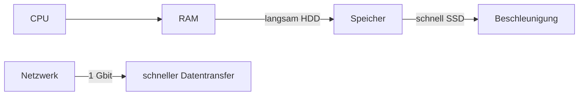

---
# Identity (stable; never change after publishing)
id: ap1-0211
slug: pc-verarbeitungsgeschwindigkeit-verbessern

# Display
title: "Maßnahmen zur Verbesserung der Verarbeitungsgeschwindigkeit"

# Classification / navigation (machine-side)
module: "Beurteilen marktgängiger IT-Systeme und Lösungen"
topics: ["leistung", "optimierung"]
tags: ["ssd", "hdd", "netzwerk", "performance"]

# Flashcard payload
card:
  type: basic
  question: "Wie kann man die Verarbeitungsgeschwindigkeit eines Personal Computers verbessern?"
  answer: "Einsatz schnellerer Datenträger (SSD/M.2 statt HDD), schnellere HDDs (höhere Drehzahl), Trennung von OS und Daten auf verschiedene Laufwerke sowie schnellere Netzwerkkarten (z. B. 1 Gbit/s statt 100 Mbit/s)."
  examples: ["SSD statt HDD einbauen", "Gigabit-Netzwerkkarte nutzen"]

# Lifecycle
status: published
created: "2026-03-17"
updated: "2026-03-17"
---

## Maßnahmen zur Verbesserung der Verarbeitungsgeschwindigkeit

Die Verarbeitungsgeschwindigkeit eines PCs kann durch gezielte Hardware- und Strukturmaßnahmen deutlich verbessert werden.

Ziel:
- schnellere Datenzugriffe  
- geringere Ladezeiten  
- effizientere Verarbeitung  

---

## Kernerklärung

### Wichtige Maßnahmen

- **Schnellere Festplatten einsetzen**
  - HDD mit höherer Drehzahl (z. B. 10.000 rpm)
- **SSD statt HDD verwenden**
  - deutlich schnellere Zugriffszeiten  
- **M.2 / NVMe SSD nutzen**
  - nochmals schneller als SATA-SSD  

- **Trennung von System und Daten**
  - Betriebssystem auf SSD  
  - Daten/Programme auf getrennten Datenträgern  

- **Netzwerk verbessern**
  - 100 Mbit/s → **1 Gbit/s Netzwerkkarte**  

---

### Vergleich Datenträger

| Datenträger | Geschwindigkeit | Vorteil |
|---|---|---|
| HDD (SATA) | langsam | günstig |
| HDD (10k rpm) | mittel | schneller als Standard-HDD |
| SSD (SATA) | schnell | gute Allround-Lösung |
| SSD (M.2/NVMe) | sehr schnell | maximale Performance |

---

### Zusammenhang

---

## Praktisches Beispiel

Ein alter PC wird aufgerüstet:

- vorher:
  - HDD + 100 Mbit Netzwerk  
- nachher:
  - SSD + 1 Gbit Netzwerk  

→ System startet schneller, Programme laden schneller  

---

## Prüfungsrelevanz (AP1)

Typisch:

- Unterschiede HDD vs. SSD  
- konkrete Optimierungsmaßnahmen aufzählen  
- Zusammenhang zwischen Speicher und Performance  

---

### Typische Prüfungsfragen

- Welche Hardware beeinflusst die Geschwindigkeit eines PCs?
- Warum ist eine SSD schneller als eine HDD?
- Welche Rolle spielt die Netzwerkkarte?

---

### Antworten auf die typischen Prüfungsfragen

**Welche Maßnahmen?**  
→ SSD, schnellere HDD, Trennung OS/Daten, bessere Netzwerkkarte  

**Warum SSD schneller?**  
→ keine mechanischen Teile → geringere Zugriffszeit  

**Netzwerk?**  
→ höhere Bandbreite = schnellerer Datentransfer  

---

## Merksatz

**SSD + klare Trennung + schnelles Netzwerk = schneller PC.**