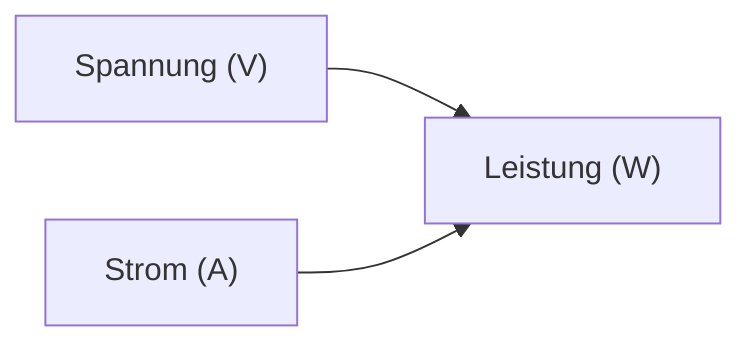

---
# Identity (stable; never change after publishing)
id: ap1-0217
slug: elektrische-leistung-berechnung

# Display
title: "Elektrische Leistung berechnen (P = U · I)"

# Classification / navigation (machine-side)
module: "Beurteilen marktgängiger IT-Systeme und Lösungen"
topics: ["elektrotechnik", "grundlagen"]
tags: ["leistung", "spannung", "strom"]

# Flashcard payload
card:
  type: basic
  question: "Auf welche Weise ermittelt man die Wirkleistung von elektrischen Geräten?"
  answer: "Die elektrische Leistung wird mit P = U · I berechnet (Leistung = Spannung × Stromstärke)."
  examples: ["230 V × 2 A = 460 W"]

# Lifecycle
status: published
created: "2026-03-17"
updated: "2026-03-17"
---

## Elektrische Leistung berechnen (P = U · I)

Die **elektrische Leistung (P)** beschreibt, wie viel Energie ein Gerät pro Zeit verbraucht oder umsetzt.

- Einheit: **Watt (W)**  
- wichtig für:
  - Stromverbrauch  
  - Dimensionierung von Netzteilen  

---

## Kernerklärung

Die grundlegende Formel lautet:

- **P = U · I**

| Symbol | Bedeutung | Einheit |
|---|---|---|
| P | Leistung | Watt (W) |
| U | Spannung | Volt (V) |
| I | Stromstärke | Ampere (A) |

👉 Bedeutung:

- Leistung ergibt sich aus:
  - **Spannung × Stromstärke**  

---

### Zusammenhang

---

## Praktisches Beispiel

Ein Gerät:

- Spannung: **230 V**  
- Strom: **2 A**

→ Rechnung:

- **P = 230 × 2 = 460 W**

---

## Prüfungsrelevanz (AP1)

Wichtig:

- Formel **P = U · I** auswendig kennen  
- Einheiten korrekt anwenden  
- einfache Berechnungen durchführen können  

---

### Typische Prüfungsfragen

- Wie lautet die Formel für elektrische Leistung?
- Welche Einheit hat die Leistung?
- Wie berechnet man die Leistung eines Geräts?

---

### Antworten auf die typischen Prüfungsfragen

**Formel?**  
→ P = U · I  

**Einheit?**  
→ Watt (W)  

**Berechnung?**  
→ Spannung × Strom  

---

## Merksatz

**Leistung = Spannung × Strom (P = U · I).**