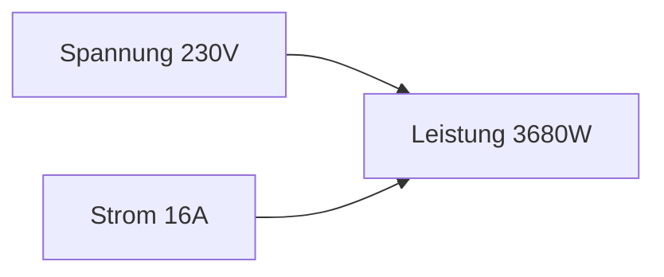

---
# Identity (stable; never change after publishing)
id: ap1-0218
slug: maximale-leistung-steckdose-berechnen

# Display
title: "Maximale Leistung einer Steckdose berechnen"

# Classification / navigation (machine-side)
module: "Beurteilen marktgängiger IT-Systeme und Lösungen"
topics: ["elektrotechnik", "leistung"]
tags: ["leistung", "spannung", "strom", "berechnung"]

# Flashcard payload
card:
  type: basic
  question: "Wodurch ergibt sich die maximale Leistung einer Steckdose (z. B. 230 V, 16 A)?"
  answer: "Mit P = U · I → 230 V × 16 A = 3.680 W (≈ 3,68 kW)."
  examples: ["230 V × 16 A = 3.680 W"]

# Lifecycle
status: published
created: "2026-03-18"
updated: "2026-03-18"
---

## Maximale Leistung einer Steckdose berechnen

Die maximale Leistung einer Steckdose ergibt sich aus:

- **Spannung (U)** und  
- **Stromstärke (I)**  

👉 Grundlage: **P = U · I**

Typischer Wert in Deutschland:

- 230 Volt  
- 16 Ampere  

---

## Kernerklärung

Formel:

- **P = U · I**

Einsetzen:

- **P = 230 V × 16 A = 3.680 W**
- entspricht **3,68 kW**

👉 Bedeutung:

- Das ist die **maximale Dauerleistung**, die eine Steckdose liefern kann  
- Wird sie überschritten → **Überlast / Sicherung fliegt**

---

### Zusammenhang

---

## Praktisches Beispiel

Mehrfachsteckdose:

- angeschlossene Geräte:
  - PC: 500 W  
  - Monitor: 100 W  
  - Drucker: 300 W  

→ Gesamt:

- **900 W** → unkritisch  

Aber:

- Heizlüfter (2000 W) + weitere Geräte → schnell nahe Grenze  

---

## Prüfungsrelevanz (AP1)

Wichtig:

- Standardwerte kennen: **230 V / 16 A**  
- Formel sicher anwenden  
- Ergebnis in **Watt und kW** angeben können  

---

### Typische Prüfungsfragen

- Wie hoch ist die maximale Leistung einer Steckdose?
- Welche Formel wird verwendet?
- Was passiert bei Überlast?

---

### Antworten auf die typischen Prüfungsfragen

**Maximale Leistung?**  
→ 3.680 W (3,68 kW)  

**Formel?**  
→ P = U · I  

**Überlast?**  
→ Sicherung löst aus  

---

## Merksatz

**230 V × 16 A = 3.680 W → maximale Steckdosenleistung.**