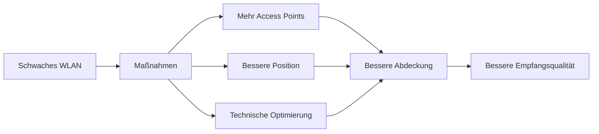

---
# Identity (stable; never change after publishing)
id: ap1-0220
slug: wlan-empfangsqualitaet-verbessern

# Display
title: "WLAN: Maßnahmen zur Verbesserung der Empfangsqualität"

# Classification / navigation (machine-side)
module: "Beurteilen marktgängiger IT-Systeme und Lösungen"
topics: ["WLAN", "Netzwerk", "Funktechnik"]
tags: ["ap1", "wlan", "optimierung"]

# Flashcard payload
card:
  type: basic       # basic | multi | steps | definition | comparison
  question: "Welche Maßnahmen verbessern die WLAN-Empfangsqualität?"
  answer: "Repeater einsetzen, Sendeleistung erhöhen (z. B. bessere Antennen), Access Point anders positionieren, anderen WLAN-Standard wählen, zusätzliche Access Points installieren, Antennencharakteristik anpassen."
  examples: []

# Lifecycle
status: published      # draft | published | deprecated
created: "2026-03-18"
updated: "2026-03-18"
---

## WLAN: Maßnahmen zur Verbesserung der Empfangsqualität
Die WLAN-Empfangsqualität hängt von mehreren Faktoren ab:
- Entfernung zum Access Point
- Hindernisse (Wände, Möbel)
- Störungen durch andere Netzwerke

Ziel ist es, die **Signalstärke und Signalqualität** zu verbessern.

## Kernerklärung
Typische Maßnahmen zur Verbesserung:

### 1. Infrastruktur anpassen
- **Repeater einsetzen** → Signal wird verstärkt
- **Weitere Access Points installieren** → bessere Flächendeckung

### 2. Positionierung optimieren
- Access Point zentral platzieren
- Hindernisse vermeiden (z. B. dicke Wände, Metall)

### 3. Technik verbessern
- **Größere/bessere Antennen** → höhere Sendeleistung
- **Antennencharakteristik ändern** → gezieltere Abstrahlung
- **Anderen WLAN-Standard nutzen** (z. B. 5 GHz / Wi-Fi 6)

### Zusammenhang

## Praktisches Beispiel
Situation:
- Raum 10: sehr guter Empfang
- Raum 11: guter Empfang
- Raum 12: schlechter Empfang

Lösungen:
- Access Point näher zu Raum 12 verschieben  
- Repeater in Flur installieren  
- Zweiten Access Point in Raum 12 hinzufügen  

➡️ Ergebnis: gleichmäßige WLAN-Abdeckung

## Prüfungsrelevanz (AP1)

### Typische Prüfungsfragen
- Nenne 3 Maßnahmen zur Verbesserung der WLAN-Qualität
- Warum hilft ein zusätzlicher Access Point?
- Welche Rolle spielt die Position des Access Points?

### Antworten auf die typischen Prüfungsfragen
- Beispiele: Repeater, bessere Antennen, Position ändern
- Mehr Access Points → kürzere Distanz → stärkeres Signal
- Schlechte Platzierung führt zu Signalverlust durch Hindernisse

## Merksatz
**WLAN-Probleme löst man durch bessere Platzierung, mehr Access Points oder stärkere/gezieltere Signalübertragung.**