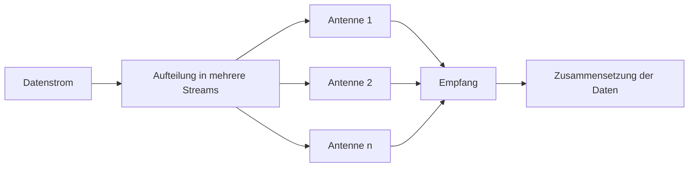

---
# Identity (stable; never change after publishing)
id: ap1-0222
slug: mimo-grundlagen

# Display
title: "MIMO: Bedeutung in der Nachrichtentechnik"

# Classification / navigation (machine-side)
module: "Beurteilen marktgängiger IT-Systeme und Lösungen"
topics: ["WLAN", "Funktechnik", "Übertragung"]
tags: ["ap1", "mimo", "netzwerk"]

# Flashcard payload
card:
  type: basic       # basic | multi | steps | definition | comparison
  question: "Was bedeutet der Begriff MIMO im Bereich der Nachrichtentechnik?"
  answer: "MIMO (Multiple Input Multiple Output) nutzt mehrere Sende- und Empfangsantennen parallel, um Datenströme gleichzeitig zu übertragen und so den Datendurchsatz zu erhöhen."
  examples: []

# Lifecycle
status: published      # draft | published | deprecated
created: "2026-03-18"
updated: "2026-03-18"
---

## MIMO: Bedeutung in der Nachrichtentechnik
MIMO ist eine Technik in drahtlosen Netzwerken (z. B. WLAN), die mehrere Antennen nutzt, um die **Datenübertragung effizienter und schneller** zu machen.

## Kernerklärung
**MIMO (Multiple Input Multiple Output)** bedeutet:

- Mehrere **Sende- und Empfangsantennen** werden gleichzeitig verwendet
- Daten werden in **mehrere parallele Datenströme** aufgeteilt
- Diese werden gleichzeitig übertragen und wieder zusammengesetzt

### Varianten
- **2x2 MIMO** → 2 Sende- / 2 Empfangsantennen  
- **3x3 MIMO** → 3 Sende- / 3 Empfangsantennen  
- **4x4 MIMO** → 4 Sende- / 4 Empfangsantennen  

### Vorteile
- Höherer **Datendurchsatz**
- Besseres **Signal-Rausch-Verhältnis**
- Stabilere Verbindung

## Praktisches Beispiel
Ein WLAN-Router mit **4x4 MIMO**:
- Sendet 4 Datenströme gleichzeitig
- Ein kompatibles Gerät kann diese parallel empfangen

➡️ Ergebnis: deutlich höhere Geschwindigkeit als bei nur einer Antenne

## Prüfungsrelevanz (AP1)

### Typische Prüfungsfragen
- Was bedeutet MIMO?
- Warum erhöht MIMO die Datenrate?
- Was bedeuten Angaben wie 2x2 oder 4x4?

### Antworten auf die typischen Prüfungsfragen
- Nutzung mehrerer Antennen für parallele Datenübertragung
- Mehrere Streams → höhere Datenrate
- Zahlen geben Anzahl der Sende- und Empfangsantennen an

## Merksatz
**MIMO nutzt mehrere Antennen gleichzeitig, um Daten parallel zu übertragen und die Geschwindigkeit zu erhöhen.**