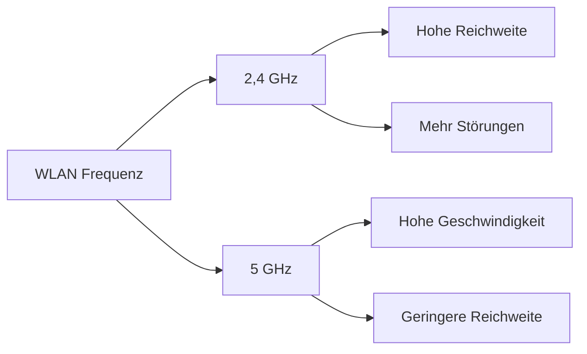

---
# Identity (stable; never change after publishing)
id: ap1-0225
slug: wlan-2-4ghz-vs-5ghz

# Display
title: "WLAN: Unterschiede zwischen 2,4 GHz und 5 GHz"

# Classification / navigation (machine-side)
module: "Beurteilen marktgängiger IT-Systeme und Lösungen"
topics: ["WLAN", "Funktechnik", "Frequenzen"]
tags: ["ap1", "wlan", "vergleich"]

# Flashcard payload
card:
  type: basic       # basic | multi | steps | definition | comparison
  question: "Nenne Vor- und Nachteile beim Einsatz eines 2,4 GHz sowie eines 5 GHz WLANs."
  answer: "2,4 GHz: große Reichweite und hohe Verbreitung, aber geringere Geschwindigkeit und störanfällig (Channel Overlapping). 5 GHz: höhere Datenraten und weniger Störungen, aber geringere Reichweite und stärkere Dämpfung durch Hindernisse."
  examples: []

# Lifecycle
status: published       # draft | published | deprecated
created: "2026-03-18"
updated: "2026-03-18"
---

## WLAN: Unterschiede zwischen 2,4 GHz und 5 GHz

WLAN (Wireless Local Area Network) nutzt hauptsächlich zwei Frequenzbereiche:

- **2,4 GHz**
- **5 GHz**

Beide haben unterschiedliche Eigenschaften hinsichtlich **Reichweite, Geschwindigkeit und Störanfälligkeit**.

## Kernerklärung

### Vergleich der Frequenzbänder

| Eigenschaft        | 2,4 GHz                         | 5 GHz                          |
|------------------|----------------------------------|--------------------------------|
| Reichweite        | hoch (bis ~300 m außen)         | geringer                       |
| Durchdringung     | gut (Wände etc.)                | schlechter                     |
| Geschwindigkeit   | geringer (bis ~600 Mbit/s)      | höher                          |
| Störungen         | hoch (viele Geräte)             | geringer                       |
| Kanäle            | wenige, überlappend             | mehr, nicht überlappend        |
| Verbreitung       | sehr hoch                       | geringer                       |

### 2,4 GHz – Vorteile
- Große Reichweite
- Gute Durchdringung von Hindernissen
- Weit verbreitet

### 2,4 GHz – Nachteile
- Störanfällig (z. B. durch andere Geräte)
- Channel Overlapping (nur wenige nutzbare Kanäle)
- Geringere Datenrate

### 5 GHz – Vorteile
- Höhere Datenraten
- Weniger Störungen
- Keine Kanalüberlappung

### 5 GHz – Nachteile
- Geringere Reichweite
- Schlechtere Durchdringung von Wänden
- Einschränkungen (z. B. DFS/TPC)

## Praktisches Beispiel
- **2,4 GHz**: Einsatz in großen Gebäuden mit vielen Wänden  
- **5 GHz**: Einsatz in Büros mit hoher Datenlast (z. B. Video, große Datenmengen)

➡️ Moderne Netzwerke nutzen oft **beide Frequenzen parallel (Dual-Band)**

## Prüfungsrelevanz (AP1)

### Typische Prüfungsfragen
- Unterschiede zwischen 2,4 GHz und 5 GHz?
- Warum ist 2,4 GHz störanfälliger?
- Wann nutzt man 5 GHz?

### Antworten auf die typischen Prüfungsfragen
- 2,4 GHz = Reichweite / 5 GHz = Geschwindigkeit
- Viele Geräte nutzen 2,4 GHz → mehr Interferenzen
- 5 GHz bei hoher Bandbreite und geringeren Störungen

## Merksatz
**2,4 GHz = Reichweite, 5 GHz = Geschwindigkeit.**