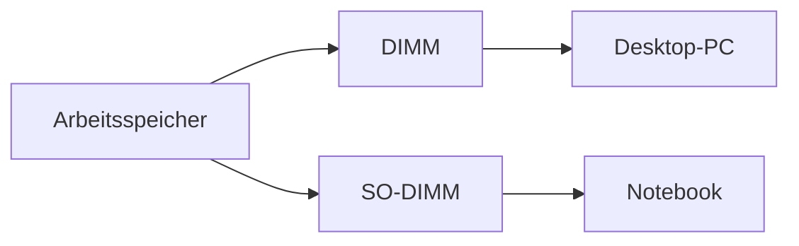

---
# Identity (stable; never change after publishing)
id: ap1-0226
slug: arbeitsspeicher-ddr3-so-dimm

# Display
title: "Arbeitsspeicher: DDR3 DIMM vs. SO-DIMM"

# Classification / navigation (machine-side)
module: "Beurteilen marktgängiger IT-Systeme und Lösungen"
topics: ["Hardware", "Arbeitsspeicher", "RAM"]
tags: ["ap1", "hardware", "ram"]

# Flashcard payload
card:
  type: basic       # basic | multi | steps | definition | comparison
  question: "Um welche Speichermodule handelt es sich auf dem Bild?"
  answer: "Links ein DDR3-SDRAM DIMM (Desktop-RAM) und rechts ein SO-DIMM (Notebook-RAM)."
  examples: []

# Lifecycle
status: published       # draft | published | deprecated
created: "2026-03-18"
updated: "2026-03-18"
---

## Arbeitsspeicher: DDR3 DIMM vs. SO-DIMM
Arbeitsspeicher (RAM) gibt es in unterschiedlichen Bauformen, je nach Einsatzgebiet:

- **DIMM (Dual Inline Memory Module)** → Desktop-PCs  
- **SO-DIMM (Small Outline DIMM)** → Notebooks / kompakte Geräte  

## Kernerklärung

### Unterschiede zwischen DIMM und SO-DIMM

| Merkmal            | DIMM (Desktop)        | SO-DIMM (Notebook)     |
|--------------------|----------------------|------------------------|
| Größe              | größer               | kleiner                |
| Einsatz            | Desktop-PC           | Notebook / Mini-PC     |
| Anzahl Pins        | mehr                 | weniger                |
| Einbau             | Mainboard (groß)     | kompakte Geräte        |

### Technische Einordnung
- Beide können z. B. **DDR3-SDRAM oder DDR4-SDRAM** sein
- Unterschied liegt **nicht in der Technologie**, sondern in der **Bauform**

## Praktisches Beispiel
- Gaming-PC → verwendet **DIMM-RAM**
- Laptop → verwendet **SO-DIMM-RAM**

➡️ Ein DIMM passt physisch nicht in einen Laptop und umgekehrt

## Prüfungsrelevanz (AP1)

### Typische Prüfungsfragen
- Unterschied zwischen DIMM und SO-DIMM?
- Wo wird welcher RAM eingesetzt?
- Woran erkennt man die Bauform?

### Antworten auf die typischen Prüfungsfragen
- DIMM = groß / SO-DIMM = klein
- Desktop vs. Notebook
- Größe und Pin-Anordnung unterscheiden sich

## Merksatz
**DIMM für Desktop, SO-DIMM für Notebook – gleiche Technik, andere Bauform.**