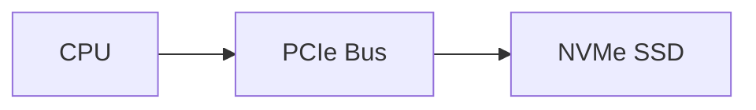

---
# Identity (stable; never change after publishing)
id: ap1-0227
slug: nvme-m2-ssd

# Display
title: "NVMe M.2 SSD: Aufbau und Eigenschaften"

# Classification / navigation (machine-side)
module: "Beurteilen marktgängiger IT-Systeme und Lösungen"
topics: ["Hardware", "Massenspeicher", "SSD"]
tags: ["ap1", "ssd", "nvme"]

# Flashcard payload
card:
  type: basic       # basic | multi | steps | definition | comparison
  question: "Was für ein Modul ist auf diesem Bild dargestellt?"
  answer: "Eine NVMe-SSD im M.2-Formfaktor, die über PCIe angebunden ist."
  examples: []

# Lifecycle
status: published       # draft | published | deprecated
created: "2026-03-18"
updated: "2026-03-18"
---

## NVMe M.2 SSD: Aufbau und Eigenschaften
Die **NVMe M.2 SSD** ist ein moderner Massenspeicher, der sich durch **sehr hohe Geschwindigkeit** und **kompakte Bauform** auszeichnet.

## Kernerklärung

### Eigenschaften
- **Formfaktor:** M.2 (flach, direkt auf dem Mainboard)
- **Schnittstelle:** PCI Express (PCIe)
- **Protokoll:** NVMe (Non-Volatile Memory Express)

### Leistungsdaten (typisch)
- Lesen: bis ca. **7.450 MB/s**
- Schreiben: bis ca. **6.900 MB/s**

### Vorteile gegenüber SATA-SSDs

| Merkmal          | SATA SSD            | NVMe M.2 SSD        |
|------------------|---------------------|----------------------|
| Anschluss        | SATA                | PCIe                 |
| Geschwindigkeit  | ~500–600 MB/s       | mehrere GB/s         |
| Bauform          | 2,5 Zoll            | M.2 (sehr kompakt)   |
| Latenz           | höher               | sehr gering          |

➡️ Direkte Anbindung an PCIe sorgt für deutlich höhere Geschwindigkeit als SATA

## Praktisches Beispiel
- Betriebssystem auf NVMe SSD → extrem schnelle Bootzeiten  
- Große Datenmengen (z. B. Video, Gaming) → deutlich schneller geladen  

➡️ Besonders wichtig für leistungsstarke PCs und Server

## Prüfungsrelevanz (AP1)

### Typische Prüfungsfragen
- Unterschied zwischen SATA-SSD und NVMe-SSD?
- Was bedeutet M.2?
- Warum ist NVMe schneller?

### Antworten auf die typischen Prüfungsfragen
- NVMe nutzt PCIe statt SATA → höhere Geschwindigkeit
- M.2 beschreibt die Bauform
- Direkte PCIe-Anbindung reduziert Engpässe

## Merksatz
**NVMe + PCIe = maximale SSD-Geschwindigkeit im M.2-Format.**