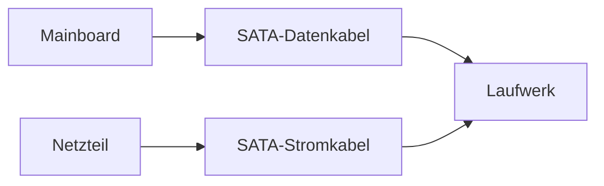

---
# Identity (stable; never change after publishing)
id: ap1-0229
slug: sata-schnittstelle-erkennen

# Display
title: "SATA-Schnittstelle: Aufbau und Eigenschaften"

# Classification / navigation (machine-side)
module: "Beurteilen marktgängiger IT-Systeme und Lösungen"
topics: ["Hardware", "Schnittstellen", "Massenspeicher"]
tags: ["ap1", "sata", "hardware"]

# Flashcard payload
card:
  type: basic       # basic | multi | steps | definition | comparison
  question: "Welche Schnittstelle ist auf dem Bild zu sehen?"
  answer: "Es handelt sich um eine SATA-Schnittstelle (Serial ATA)."
  examples: []

# Lifecycle
status: published  # draft | published | deprecated
created: "2026-03-18"
updated: "2026-03-18"
---

## SATA-Schnittstelle: Aufbau und Eigenschaften
Die **SATA-Schnittstelle (Serial ATA)** ist eine standardisierte Verbindung zur Anbindung von:

- Festplatten (HDD)
- SSDs
- optischen Laufwerken

## Kernerklärung

### Eigenschaften von SATA
- Serielle Datenübertragung
- Aktuelle Version: **SATA III (6 Gbit/s)**
- Weit verbreitet in PCs und Servern

### Aufbau der Schnittstelle
SATA besteht aus zwei getrennten Steckverbindungen:

| Anschluss         | Funktion                | Pins |
|------------------|-------------------------|------|
| Datenstecker     | Datenübertragung        | 7    |
| Stromstecker     | Stromversorgung         | 15   |

➡️ Beide Stecker werden gleichzeitig benötigt

## Praktisches Beispiel
Ein PC enthält eine SSD:

- Datenkabel → verbindet SSD mit Mainboard  
- Stromkabel → versorgt SSD mit Energie  

➡️ Ohne beide Verbindungen funktioniert das Laufwerk nicht

## Prüfungsrelevanz (AP1)

### Typische Prüfungsfragen
- Wofür wird SATA verwendet?
- Wie viele Pins hat ein SATA-Datenstecker?
- Unterschied zwischen SATA und NVMe?

### Antworten auf die typischen Prüfungsfragen
- Anschluss von Massenspeichern
- 7 Pins (Daten), 15 Pins (Strom)
- SATA langsamer, NVMe nutzt PCIe

## Merksatz
**SATA = Standardanschluss für Laufwerke mit Daten- und Stromstecker.**