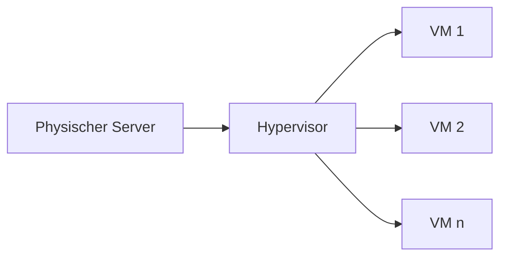

---
# Identity (stable; never change after publishing)
id: ap1-0131
slug: virtualisierung-vor-und-nachteile

# Display
title: "Virtualisierung: Vor- und Nachteile (inkl. Cloud)"

# Classification / navigation (machine-side)
module: "Beurteilen marktgängiger IT-Systeme und Lösungen"
topics: ["Virtualisierung", "Cloud", "Server"]
tags: ["ap1", "virtualisierung", "cloud"]

# Flashcard payload
card:
  type: basic       # basic | multi | steps | definition | comparison
  question: "Nenne die Vor- und Nachteile der Virtualisierung von Servern und Desktops (inkl. Cloud)."
  answer: "Vorteile: Stromersparnis, Skalierbarkeit, Redundanz, schnelle Bereitstellung, geringe Investitionskosten (Cloud). Nachteile: evtl. höhere Latenz, nicht immer 24/7 kostengünstig, Abhängigkeit von Hardware/Software und Anbieter, eingeschränkte Individualisierung."
  examples: []

# Lifecycle
status: published       # draft | published | deprecated
created: "2026-03-18"
updated: "2026-03-18"
---

## Virtualisierung: Vor- und Nachteile (inkl. Cloud)
Virtualisierung ermöglicht es, mehrere **virtuelle Systeme auf einer physischen Hardware** zu betreiben.

➡️ Häufig genutzt für:
- Server (Server-Virtualisierung)
- Desktops (VDI)
- Cloud-Umgebungen

## Kernerklärung

### Vorteile

- **Stromersparnis** (weniger physische Hardware)
- **Skalierbarkeit** (Ressourcen flexibel anpassen)
- **Redundanz / Ausfallsicherheit**
- **Schnelle Bereitstellung von Systemen**
- **Kaum Kapazitätsgrenzen (Cloud)**
- **Geringe Investitionskosten** (Pay-as-you-go)
- **Lebensverlängerung alter Software**

### Nachteile

- **Nicht jede Lösung ist für 24/7 günstig**
- **Höhere Latenzen möglich**
- **Abhängigkeit von Hardware / Software / Anbieter**
- **Nicht alles vollständig selbst administrierbar**
- **Eingeschränkte Individualisierung**
- **Nicht überall verfügbar (Regionen / Anbieter)**

## Praktisches Beispiel
Ein Unternehmen nutzt Cloud-Server:

- Früher: mehrere physische Server → hohe Kosten  
- Heute: virtuelle Maschinen in der Cloud  
- Vorteil: flexible Skalierung bei Lastspitzen  

➡️ Beispiel: Webserver wird bei hoher Nachfrage automatisch erweitert

## Prüfungsrelevanz (AP1)

### Typische Prüfungsfragen
- Was ist Virtualisierung?
- Nenne Vorteile der Virtualisierung
- Welche Nachteile hat Cloud Computing?

### Antworten auf die typischen Prüfungsfragen
- Mehrere virtuelle Systeme auf einer Hardware
- Kostenersparnis, Skalierbarkeit, schnelle Bereitstellung
- Abhängigkeit, Latenz, Kosten bei Dauerbetrieb

## Merksatz
**Virtualisierung spart Hardware und bringt Flexibilität – kostet aber Kontrolle und kann Latenzen erhöhen.**