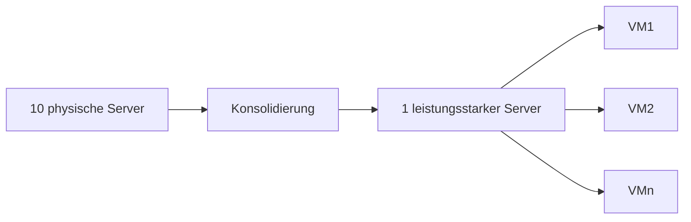

---
# Identity (stable; never change after publishing)
id: ap1-0232
slug: serverkonsolidierung-definition

# Display
title: "Serverkonsolidierung – Definition und Zweck"

# Classification / navigation (machine-side)
module: "Beurteilen marktgängiger IT-Systeme und Lösungen"
topics: ["Virtualisierung", "Server", "Konsolidierung"]
tags: ["ap1", "server", "virtualisierung"]

# Flashcard payload
card:
  type: basic       # basic | multi | steps | definition | comparison
  question: "Was bedeutet der Begriff Serverkonsolidierung?"
  answer: "Serverkonsolidierung ist die Zusammenführung mehrerer physischer Server auf weniger leistungsfähige Systeme mittels Virtualisierung, um Ressourcen effizienter zu nutzen sowie Energie- und Platz zu sparen."
  examples: ["10 physische Server werden auf einem leistungsstarken Server virtualisiert."]

# Lifecycle
status: published      # draft | published | deprecated
created: "2026-03-18"
updated: "2026-03-18"
---

## Serverkonsolidierung – Definition und Zweck
Serverkonsolidierung beschreibt die **Reduzierung physischer Server** durch Einsatz von Virtualisierungstechnologien.

➡️ Ziel:
- bessere Ressourcennutzung  
- geringere Kosten  
- effizienterer Betrieb  

## Kernerklärung

- Mehrere physische Server → **ein leistungsstarker Server**
- Nutzung von:
  - **Virtuellen Maschinen (VMs)**
  - **Virtuellen Umgebungen (VE)**
- Einsparungen:
  - **Energie**
  - **Platz im Rechenzentrum**
- Effizienzsteigerung durch **zentrale Verwaltung**

## Praktisches Beispiel

Vorher:
- 10 einzelne Server mit geringer Auslastung

Nachher:
- 1 leistungsstarker Server
- darauf laufen 10 virtuelle Server

➡️ Ergebnis:
- weniger Stromverbrauch  
- weniger Hardware  
- gleiche Funktionalität  

## Prüfungsrelevanz (AP1)

### Typische Prüfungsfragen
- Was ist Serverkonsolidierung?
- Warum wird Serverkonsolidierung eingesetzt?
- Welche Technologien werden dabei genutzt?

### Antworten auf die typischen Prüfungsfragen
- Zusammenlegung mehrerer Server auf weniger Hardware
- Kosten-, Energie- und Platzersparnis
- Virtualisierung (VMs, Hypervisor)

## Merksatz
**Serverkonsolidierung = weniger Hardware durch Virtualisierung bei gleicher Leistung.**