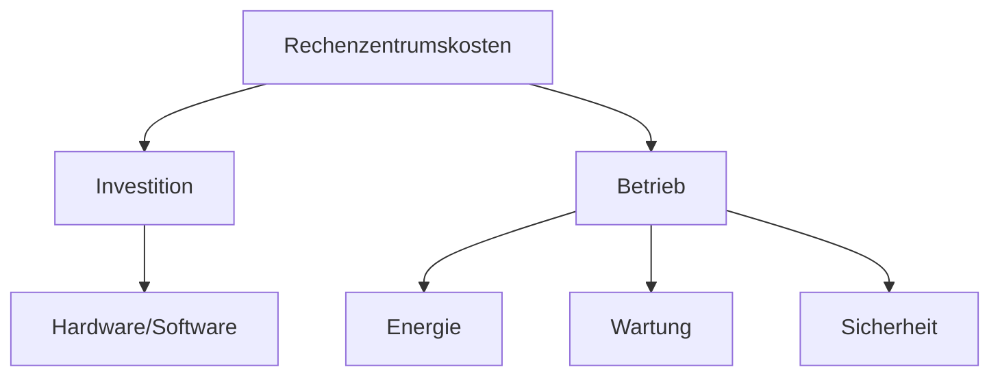

---
# Identity (stable; never change after publishing)
id: ap1-0234
slug: kosten-rechenzentrum-on-premises

# Display
title: "Kosten eines Rechenzentrums (On-Premises)"

# Classification / navigation (machine-side)
module: "Beurteilen marktgängiger IT-Systeme und Lösungen"
topics: ["Kosten", "Rechenzentrum", "On-Premises"]
tags: ["ap1", "kosten", "server"]

# Flashcard payload
card:
  type: basic       # basic | multi | steps | definition | comparison
  question: "Mit welchen Kosten muss für ein On-Premises-Rechenzentrum mit einer Server-Client-Struktur gerechnet werden?"
  answer: "Kosten für Gebäude/Raum, Anschaffung (Hardware/Software), Leasing/Miete, Lizenzen, Energiekosten, Wartung, Sicherheitstechnik, Brandschutz und Versicherungen."
  examples: ["Serverhardware kaufen", "Stromkosten für Kühlung", "Softwarelizenzen"]

# Lifecycle
status: published       # draft | published | deprecated
created: "2026-03-18"
updated: "2026-03-18"
---

## Kosten eines Rechenzentrums (On-Premises)
Ein **On-Premises-Rechenzentrum** wird im eigenen Unternehmen betrieben und verursacht sowohl **einmalige als auch laufende Kosten**.

➡️ Wichtig für AP1: Kostenarten kennen und unterscheiden können.

## Kernerklärung

### Wichtige Kostenarten

| Kostenart | Beschreibung |
|----------|-------------|
| **Gebäude/Raum** | Kauf oder Miete von Serverräumen |
| **Anschaffungskosten** | Hardware (Server, Netzwerk), Software |
| **Leasing/Miete** | Alternative zur direkten Anschaffung |
| **Lizenzkosten** | Betriebssysteme und Anwendungssoftware |
| **Energiekosten** | Strom für Server, Kühlung, Infrastruktur |
| **Wartung/Instandhaltung** | Reparaturen, Updates, Service |
| **Sicherheitstechnik** | Zutrittskontrolle, Überwachung |
| **Brandschutz** | Feuerlöschsysteme |
| **Versicherungen** | Absicherung gegen Schäden |

➡️ Man unterscheidet:
- **Investitionskosten (CAPEX)** → z. B. Anschaffung  
- **Betriebskosten (OPEX)** → z. B. Strom, Wartung  

## Praktisches Beispiel

Ein Unternehmen betreibt eigene Server:

- Kauf von Servern: 20.000 €  
- Stromkosten pro Jahr: 5.000 €  
- Lizenzen: 2.000 € jährlich  

➡️ Gesamtkosten entstehen **einmalig + laufend**

## Prüfungsrelevanz (AP1)

### Typische Prüfungsfragen
- Nenne typische Kosten eines Rechenzentrums
- Was gehört zu Betriebskosten?
- Unterschied CAPEX vs. OPEX?

### Antworten auf die typischen Prüfungsfragen
- Gebäude, Hardware, Lizenzen, Energie, Wartung, Sicherheit  
- Energie, Wartung, Versicherungen  
- CAPEX = einmalige Investition, OPEX = laufende Kosten  

## Merksatz
**On-Premises bedeutet volle Kontrolle – aber auch volle Kostenverantwortung.**