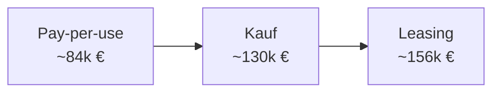

---
# Identity (stable; never change after publishing)
id: ap1-0235
slug: kostenvergleich-leasing-kauf-pay-per-use

# Display
title: "Kostenvergleich: Leasing vs. Kauf vs. Pay-per-use"

# Classification / navigation (machine-side)
module: "Beurteilen marktgängiger IT-Systeme und Lösungen"
topics: ["Kostenvergleich", "Cloud", "Betriebsmodelle"]
tags: ["ap1", "leasing", "cloud", "kosten"]

# Flashcard payload
card:
  type: basic       # basic | multi | steps | definition | comparison
  question: "Welche Variante ist über 3 Jahre kostengünstiger: Leasing, Kauf oder Pay-per-use?"
  answer: "Pay-per-use ist am günstigsten (~84.621,60 €), danach Kauf (~130.000 €), am teuersten ist Leasing (~156.000 €)."
  examples: ["Pay-per-use: 3,22 €/h", "Kauf: 100.000 € + Service", "Leasing: monatliche Raten"]

# Lifecycle
status: published       # draft | published | deprecated
created: "2026-03-18"
updated: "2026-03-18"
---

## Kostenvergleich: Leasing vs. Kauf vs. Pay-per-use
Beim Vergleich von IT-Betriebsmodellen werden die Gesamtkosten über einen Zeitraum (hier: **3 Jahre**) betrachtet.

➡️ Drei typische Modelle:
- Leasing  
- Kauf (On-Premises)  
- Pay-per-use (Cloud)  

## Kernerklärung

### Kostenübersicht (3 Jahre)

| Modell        | Berechnung | Gesamtkosten |
|--------------|-----------|-------------|
| **Leasing**  | 36 × 3.500 € + 30.000 € Service | **156.000 €** |
| **Kauf**     | 100.000 € + 30.000 € Service | **130.000 €** |
| **Pay-per-use** | 3,22 €/h × 24 h × 365 d × 3 Jahre | **84.621,60 €** |

### Rangfolge

1. **Pay-per-use (günstigstes Modell)**  
2. **Kauf**  
3. **Leasing (teuerstes Modell)**  

## Praktisches Beispiel

Ein Unternehmen benötigt Serverleistung:

- **Leasing:** monatliche Fixkosten  
- **Kauf:** hohe Anfangsinvestition  
- **Cloud:** nutzungsabhängige Kosten  

➡️ Bei dauerhafter Nutzung kann Kauf sinnvoll sein,  
➡️ bei flexibler Nutzung ist Pay-per-use oft günstiger  

## Prüfungsrelevanz (AP1)

### Typische Prüfungsfragen
- Welche Variante ist am günstigsten?
- Wie berechnet man Pay-per-use?
- Wann lohnt sich Kauf vs. Cloud?

### Antworten auf die typischen Prüfungsfragen
- Pay-per-use ist am günstigsten  
- Preis pro Stunde × Nutzungszeit  
- Kauf bei dauerhafter Nutzung, Cloud bei Flexibilität  

## Merksatz
**Je flexibler die Nutzung, desto sinnvoller Pay-per-use – je konstanter, desto eher Kauf.**