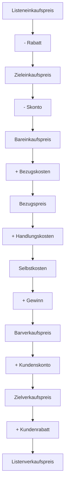

---
# Identity (stable; never change after publishing)
id: ap1-0236
slug: handelskalkulation-bestandteile

# Display
title: "Handelskalkulation: Bestandteile und Abgrenzung zur Zuschlagskalkulation"

# Classification / navigation (machine-side)
module: "Beurteilen marktgängiger IT-Systeme und Lösungen"
topics: ["Kalkulation", "Kostenrechnung", "BWL"]
tags: ["ap1", "handelskalkulation", "zuschlagskalkulation"]

# Flashcard payload
card:
  type: basic       # basic | multi | steps | definition | comparison
  question: "Aus welchen Bestandteilen besteht eine Handelskalkulation und wie unterscheidet sie sich von der Zuschlagskalkulation (Vorkalkulation)?"
  answer: "Handelskalkulation: Listeneinkaufspreis → Zieleinkaufspreis → Bareinkaufspreis → Bezugspreis → Selbstkosten → Barverkaufspreis → Zielverkaufspreis → Listenverkaufspreis. Unterschied: Zuschlagskalkulation berechnet Selbstkosten aus Herstellkosten (Material, Lohn, Gemeinkosten)."
  examples: ["Rabatt und Skonto im Einkauf", "Gewinnaufschlag im Verkauf"]

# Lifecycle
status: published       # draft | published | deprecated
created: "2026-03-18"
updated: "2026-03-18"
---

## Handelskalkulation: Bestandteile und Abgrenzung zur Zuschlagskalkulation
Die **Handelskalkulation** dient zur Ermittlung von Einkaufs- und Verkaufspreisen im Handel.

➡️ Unterschied:
- **Handel** → arbeitet mit Ein- und Verkaufspreisen  
- **Produktion (Zuschlagskalkulation)** → arbeitet mit Herstellkosten  

## Kernerklärung

### Ablauf der Handelskalkulation

### Bestandteile im Überblick

| Bereich | Bestandteile |
|--------|-------------|
| **Einkauf** | Listeneinkaufspreis, Rabatt, Skonto |
| **Beschaffung** | Bezugskosten |
| **Kosten** | Handlungskosten → Selbstkosten |
| **Verkauf** | Gewinn, Kundenskonto, Kundenrabatt |

---

### Zuschlagskalkulation (Vorkalkulation)

➡️ Wird in der **Produktion** verwendet:

| Kostenart | Beispiele |
|----------|----------|
| Materialkosten | Materialeinzelkosten + Gemeinkosten |
| Lohnkosten | Fertigungslöhne + Gemeinkosten |
| Herstellkosten | Summe aus Material + Lohn |
| Selbstkosten | + Verwaltungs- und Vertriebskosten |

## Praktisches Beispiel

Ein Händler kauft Ware:

- Listeneinkaufspreis: 1.000 €  
- Rabatt: 10 % → 900 €  
- + Bezugskosten: 50 € → Bezugspreis 950 €  
- + Gewinn: → Verkaufspreis entsteht  

➡️ Ziel: profitabler Verkaufspreis

## Prüfungsrelevanz (AP1)

### Typische Prüfungsfragen
- Reihenfolge der Handelskalkulation?
- Unterschied Handels- vs. Zuschlagskalkulation?
- Was sind Bezugskosten?

### Antworten auf die typischen Prüfungsfragen
- Einkauf → Kosten → Verkauf  
- Handel = Preise, Produktion = Kostenstruktur  
- Transport, Verpackung etc.

## Merksatz
**Handelskalkulation = vom Einkauf zum Verkaufspreis, Zuschlagskalkulation = von Kosten zum Preis.**