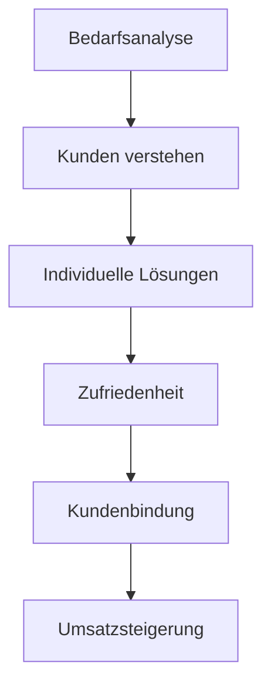

---
# Identity (stable; never change after publishing)
id: ap1-0238
slug: vorteile-bedarfsanalyse

# Display
title: "Vorteile der Bedarfsanalyse"

# Classification / navigation (machine-side)
module: "Entwickeln, Erstellen und Betreuen von IT_Lösungen"
topics: ["Analyse", "Kundenorientierung", "Planung"]
tags: ["ap1", "bedarfsanalyse", "vorteile"]

# Flashcard payload
card:
  type: basic       # basic | multi | steps | definition | comparison
  question: "Welche Vorteile bietet eine Bedarfsanalyse?"
  answer: "Ermittlung von Kundenwünschen und -zielen, Identifikation von Kundentypen, stärkere Kundenbindung, individuelle Lösungen, Wettbewerbsvorteile und Umsatzsteigerung."
  examples: ["Individuelle IT-Lösung für Kunden", "Gezielte Produktentwicklung"]

# Lifecycle
status: published       # draft | published | deprecated
created: "2026-03-18"
updated: "2026-03-18"
---

## Vorteile der Bedarfsanalyse
Die **Bedarfsanalyse** bietet Unternehmen wichtige Vorteile, insbesondere im Vertrieb und in der Kundenorientierung.

 Ziel:
- Kunden besser verstehen und gezielt bedienen

## Kernerklärung

Vorteile der Bedarfsanalyse:

- **Ermittlung von Kundenbedürfnissen**
  - Wünsche, Motive und Ziele werden erkannt
- **Kundentypen identifizieren**
  - bessere Ansprache und Segmentierung
- **Vertrauensaufbau**
  - Kunden fühlen sich verstanden
- **Individuelle Lösungen**
  - maßgeschneiderte Angebote möglich
- **Wettbewerbsvorteil**
  - Abhebung von Konkurrenz
- **Umsatzsteigerung**
  - gezieltere Angebote führen zu mehr Verkäufen
- **Langfristige Kundenbindung**
  - nachhaltige Geschäftsbeziehungen

## Praktisches Beispiel

Ein IT-Dienstleister analysiert den Bedarf eines Kunden:

- Erkennt: Bedarf an Cloud-Lösung + Skalierbarkeit  
- Lösung: Individuelle Cloud-Infrastruktur  
- Ergebnis: zufriedener Kunde + langfristiger Vertrag  

## Prüfungsrelevanz (AP1)

### Typische Prüfungsfragen
- Welche Vorteile hat eine Bedarfsanalyse?
- Warum ist sie im Vertrieb wichtig?
- Welche Auswirkungen hat sie auf den Umsatz?

### Antworten auf die typischen Prüfungsfragen
- bessere Kundenkenntnis, individuelle Lösungen, Wettbewerbsvorteil  
- gezielte Ansprache und Bedarfserfüllung  
- steigert Umsatz und Kundenbindung  

## Merksatz
**Wer den Bedarf kennt, verkauft besser.**