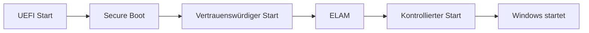

---
# Identity (stable; never change after publishing)
id: ap1-0243
slug: windows-boot-sicherheitsfeatures

# Display
title: "Sicherheitsfeatures beim Windows-Start"

# Classification / navigation (machine-side)
module: "Entwickeln, Erstellen und Betreuen von IT_Lösungen"
topics: ["Sicherheit", "Bootprozess", "UEFI"]
tags: ["ap1", "windows", "boot", "security"]

# Flashcard payload
card:
  type: basic       # basic | multi | steps | definition | comparison
  question: "Welche 4 Features schützen den Windows-10-Startvorgang vor dem Laden von Schadsoftware wie Rootkits und Bootkits?"
  answer: "Sicherer Start (Secure Boot), vertrauenswürdiger Start, Antischadsoftware-Frühstart (ELAM), kontrollierter Start."
  examples: ["Secure Boot verhindert unsignierte Bootloader", "ELAM prüft Treiber beim Start"]

# Lifecycle
status: published       # draft | published | deprecated
created: "2026-03-18"
updated: "2026-03-18"
---

## Sicherheitsfeatures beim Windows-Start
Windows nutzt mehrere Sicherheitsmechanismen im Bootprozess, um Schadsoftware bereits vor dem Systemstart zu verhindern.

Diese schützen insbesondere vor Rootkits und Bootkits.

## Kernerklärung

### Die 4 Sicherheitsfeatures

1. **Sicherer Start (Secure Boot)**
   - nur vertrauenswürdige Bootloader werden geladen
   - basiert auf UEFI und TPM

2. **Vertrauenswürdiger Start**
   - überprüft Integrität aller Komponenten beim Start
   - verhindert Manipulationen im Bootprozess

3. **Antischadsoftware-Frühstart (ELAM)**
   - prüft Treiber vor dem Laden
   - blockiert nicht signierte oder verdächtige Treiber

4. **Kontrollierter Start**
   - protokolliert Startvorgang
   - ermöglicht Integritätsprüfung durch externe Systeme

## Praktisches Beispiel

- Ein manipuliertes Bootkit wird erkannt:
  - Secure Boot verhindert das Laden
- Ein unsignierter Treiber:
  - wird durch ELAM blockiert

## Prüfungsrelevanz (AP1)

### Typische Prüfungsfragen
- Welche Schutzmechanismen gibt es beim Windows-Start?
- Was macht Secure Boot?
- Wofür steht ELAM?

### Antworten auf die typischen Prüfungsfragen
- Secure Boot, vertrauenswürdiger Start, ELAM, kontrollierter Start  
- Verhindert unsignierte Bootloader  
- Early Launch Anti Malware  

## Merksatz
Vier Schutzstufen sichern den Windows-Start: Secure Boot, Vertrauen, ELAM und Kontrolle.