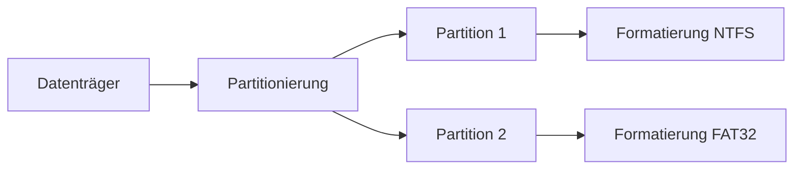

---
# Identity (stable; never change after publishing)
id: ap1-0244
slug: partitionierung-vs-formatierung

# Display
title: "Partitionierung vs. Formatierung"

# Classification / navigation (machine-side)
module: "Entwickeln, Erstellen und Betreuen von IT_Lösungen"
topics: ["Speicher", "Datenträger", "Dateisysteme"]
tags: ["ap1", "partition", "formatierung", "dateisystem"]

# Flashcard payload
card:
  type: comparison       # basic | multi | steps | definition | comparison
  question: "Was ist der Unterschied zwischen Partitionierung und Formatierung eines Datenträgers?"
  answer: "Partitionierung teilt den Datenträger in logische Bereiche (Volumes). Formatierung richtet innerhalb einer Partition ein Dateisystem (z. B. NTFS) ein."
  examples: ["Festplatte in C: und D: aufteilen (Partitionierung)", "NTFS auf C: einrichten (Formatierung)"]

# Lifecycle
status: published       # draft | published | deprecated
created: "2026-03-18"
updated: "2026-03-18"
---

## Partitionierung vs. Formatierung
Bevor ein Datenträger genutzt werden kann, sind zwei Schritte notwendig:

- Partitionierung  
- Formatierung  

Beide haben unterschiedliche Aufgaben.

## Kernerklärung

### Unterschied im Überblick

| Merkmal | Partitionierung | Formatierung |
|--------|----------------|-------------|
| Zweck | Aufteilung des Datenträgers | Einrichtung eines Dateisystems |
| Ebene | physisch + logisch | logisch |
| Ergebnis | Volumes/Partitionen | nutzbares Dateisystem |
| Beispiele | C:, D: | NTFS, FAT32, ext4 |

### Details

- **Partitionierung**
  - teilt den Speicher in mehrere Bereiche
  - fasst zusammenhängende Datenblöcke logisch zusammen
  - Grundlage für mehrere Laufwerke auf einer Festplatte

- **Formatierung**
  - erstellt ein Dateisystem innerhalb einer Partition
  - organisiert Dateien und Ordner
  - ermöglicht Zugriff durch das Betriebssystem

## Praktisches Beispiel

1. Neue Festplatte einbauen  
2. Partition erstellen (z. B. 500 GB → C:, 500 GB → D:)  
3. Jede Partition formatieren (z. B. NTFS)  

Ergebnis:
- Zwei nutzbare Laufwerke im System  

## Prüfungsrelevanz (AP1)

### Typische Prüfungsfragen
- Was macht die Partitionierung?
- Wofür ist die Formatierung notwendig?
- Welche Dateisysteme gibt es?

### Antworten auf die typischen Prüfungsfragen
- Aufteilung des Datenträgers in Bereiche  
- Einrichtung eines Dateisystems  
- NTFS, FAT32, ext4  

## Merksatz
Partitionierung teilt den Speicher – Formatierung macht ihn nutzbar.