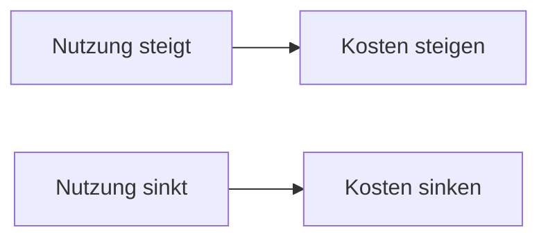

---
# Identity (stable; never change after publishing)
id: ap1-0248
slug: pay-per-use-vorteile-nachteile

# Display
title: "Pay-per-use Lizenzmodell"

# Classification / navigation (machine-side)
module: "Entwickeln, Erstellen und Betreuen von IT_Lösungen"
topics: ["Lizenzmodelle", "Kostenmodelle", "IT-Betrieb"]
tags: ["ap1", "pay-per-use", "cloud", "kosten"]

# Flashcard payload
card:
  type: comparison       # basic | multi | steps | definition | comparison
  question: "Was sind die Vor- und Nachteile beim Lizenzmodell Pay-per-use?"
  answer: "Vorteile: keine Anfangsinvestition, skalierbar, geringes finanzielles Risiko. Nachteile: laufende Kosten, Abhängigkeit vom Anbieter, bei Dauerbetrieb oft teurer."
  examples: ["Cloud-Dienste wie AWS oder Azure", "Bezahlung pro Nutzung von Rechenleistung"]

# Lifecycle
status: published       # draft | published | deprecated
created: "2026-03-18"
updated: "2026-03-18"
---

## Pay-per-use Lizenzmodell
Beim Pay-per-use-Modell zahlt man nur für tatsächlich genutzte Leistungen.

Es wird häufig bei Cloud-Services eingesetzt.

## Kernerklärung

**Prinzip:**
- Abrechnung erfolgt nach Nutzung (z. B. Stunden, Datenmenge)

### Vorteile
- keine hohe Anfangsinvestition
- flexibel skalierbar (je nach Bedarf)
- geringes finanzielles Risiko
- keine Kapitalbindung

### Nachteile
- langfristig oft teurer (z. B. 24/7 Nutzung)
- Abhängigkeit vom Anbieter
- Risiko bei Ausfall des Dienstleisters
- eingeschränkte Individualisierung möglich

| Kriterium        | Pay-per-use |
|------------------|------------|
| Kostenstruktur   | variabel   |
| Investition      | gering     |
| Skalierbarkeit   | hoch       |
| Risiko           | gering (initial), höher bei Abhängigkeit |

## Praktisches Beispiel

- Ein Unternehmen nutzt Cloud-Server:
  - bezahlt pro Stunde Laufzeit
  - bei geringer Nutzung niedrige Kosten
  - bei Dauerbetrieb steigen die Kosten stark

## Prüfungsrelevanz (AP1)

### Typische Prüfungsfragen
- Was ist Pay-per-use?
- Nenne Vorteile und Nachteile
- Wann lohnt sich das Modell?

### Antworten auf die typischen Prüfungsfragen
- Bezahlung nach tatsächlicher Nutzung  
- Vorteile: flexibel, keine Anfangskosten  
- Nachteile: langfristig teuer, Abhängigkeit  
- sinnvoll bei schwankender Nutzung  

## Merksatz
Pay-per-use spart am Anfang, kann aber bei Dauerbetrieb teuer werden.