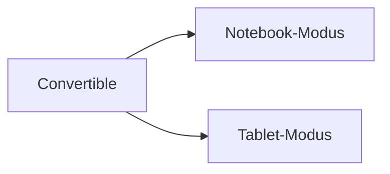

---
# Identity (stable; never change after publishing)
id: ap1-0250
slug: convertible-definition

# Display
title: "Convertible (2-in-1-Gerät)"

# Classification / navigation (machine-side)
module: "Entwickeln, Erstellen und Betreuen von IT_Lösungen"
topics: ["Hardware", "Endgeräte", "Mobile Geräte"]
tags: ["ap1", "convertible", "notebook", "tablet"]

# Flashcard payload
card:
  type: definition       # basic | multi | steps | definition | comparison
  question: "Wie definiert man den Begriff Convertible?"
  answer: "Ein Convertible ist ein hybrides Gerät (2-in-1), das sowohl als Notebook als auch als Tablet genutzt werden kann."
  examples: ["Laptop mit umklappbarem Display", "Notebook mit abnehmbarem Bildschirm"]

# Lifecycle
status: published       # draft | published | deprecated
created: "2026-03-18"
updated: "2026-03-18"
---

## Convertible (2-in-1-Gerät)
Ein Convertible ist ein mobiles Endgerät mit kombinierter Funktionalität.

Es vereint die Eigenschaften von Notebook und Tablet.

## Kernerklärung

- auch genannt:
  - Hybrid-PC  
  - 2-in-1-Gerät  
  - Detachable (bei abnehmbarem Display)

- Eigenschaften:
  - Display kann:
    - gedreht  
    - geklappt  
    - geschoben  
    - abgenommen werden  
  - Nutzung in zwei Modi:
    - Notebook-Modus (Tastatur + Touchpad)
    - Tablet-Modus (Touchscreen oder Stift)

- Fokus:
  - hohe Mobilität  
  - flexible Nutzung  

## Praktisches Beispiel

- Im Büro:
  - Nutzung als klassisches Notebook mit Tastatur  

- Unterwegs oder Präsentation:
  - Umklappen → Nutzung als Tablet  
  - Bedienung per Touch oder Stift  

## Prüfungsrelevanz (AP1)

### Typische Prüfungsfragen
- Was ist ein Convertible?
- Welche Betriebsmodi gibt es?
- Wodurch zeichnet es sich aus?

### Antworten auf die typischen Prüfungsfragen
- Kombination aus Notebook und Tablet  
- Notebook- und Tablet-Modus  
- flexible Bauweise (klappbar/abnehmbar)  

## Merksatz
Ein Convertible ist ein Laptop, der sich in ein Tablet verwandeln lässt.