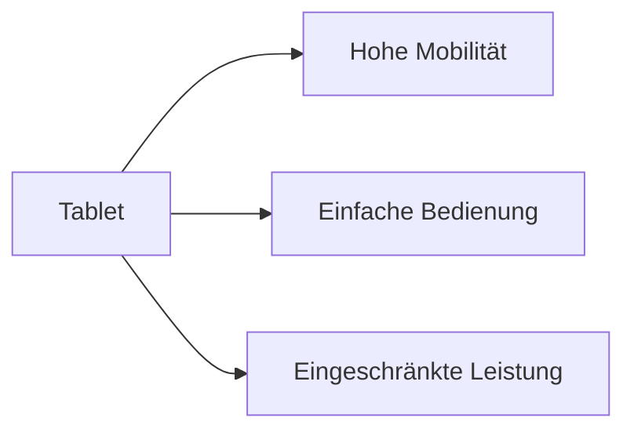

---
# Identity (stable; never change after publishing)
id: ap1-0251
slug: tablet-vor-und-nachteile

# Display
title: "Tablet – Vor- und Nachteile"

# Classification / navigation (machine-side)
module: "Entwickeln, Erstellen und Betreuen von IT_Lösungen"
topics: ["Hardware", "Endgeräte", "Mobile Geräte"]
tags: ["ap1", "tablet", "hardware"]

# Flashcard payload
card:
  type: comparison       # basic | multi | steps | definition | comparison
  question: "Was sind Vor- und Nachteile von Tablets?"
  answer: "Vorteile: leicht, mobil, lange Akkulaufzeit, Touchbedienung. Nachteile: eingeschränkte Eingabe, geringere Leistung/Speicher, wenige Anschlüsse, kaum aufrüstbar."
  examples: ["Tablet für Präsentationen", "Mobiles Arbeiten mit Touchbedienung"]

# Lifecycle
status: published       # draft | published | deprecated
created: "2026-03-18"
updated: "2026-03-18"
---

## Tablet – Vor- und Nachteile
Tablets sind mobile Endgeräte mit Fokus auf einfache Bedienung und hohe Mobilität.

Sie werden hauptsächlich per Touchscreen gesteuert.

## Kernerklärung

### Vorteile
- leichte Handhabung  
- lange Akkulaufzeit  
- Touchbedienung (optional mit Stift)  
- WLAN oder WWAN Verbindung möglich  
- platzsparend  
- geringes Gewicht  

### Nachteile
- Schreiben auf virtueller Tastatur auf Dauer anstrengend  
- geringere Speicher- und Leistungsfähigkeit als Notebooks  
- wenige Anschluss- und Erweiterungsmöglichkeiten  
- meist nicht oder nur schwer aufrüstbar  

| Kriterium        | Tablet Vorteil                 | Tablet Nachteil                  |
|------------------|------------------------------|----------------------------------|
| Mobilität        | sehr hoch                     | eingeschränkte Produktivität     |
| Bedienung        | einfach (Touch)               | Tippen langsamer                 |
| Hardware         | leicht, kompakt               | weniger Leistung                 |
| Erweiterbarkeit  | -                             | kaum möglich                     |

## Praktisches Beispiel

- Außendienst:
  - Präsentationen direkt beim Kunden  
  - Dateneingabe per Touch oder Stift  

- Freizeit:
  - Surfen, Streaming, Apps  

## Prüfungsrelevanz (AP1)

### Typische Prüfungsfragen
- Nenne Vorteile von Tablets
- Nenne Nachteile von Tablets
- Wann sind Tablets sinnvoll?

### Antworten auf die typischen Prüfungsfragen
- Vorteile: mobil, leicht, lange Akkulaufzeit  
- Nachteile: eingeschränkte Leistung, Eingabe schwierig  
- sinnvoll für mobile Nutzung und einfache Anwendungen  

## Merksatz
Tablets sind leicht und mobil, aber weniger leistungsfähig und eingeschränkt erweiterbar.