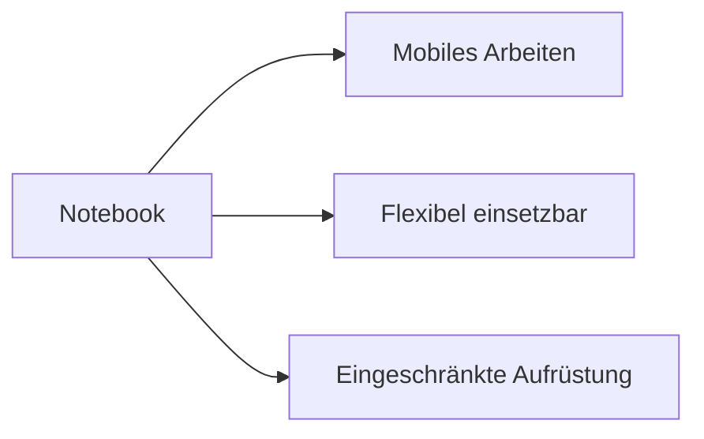

---
# Identity (stable; never change after publishing)
id: ap1-0252
slug: notebook-vor-und-nachteile

# Display
title: "Notebook – Vor- und Nachteile"

# Classification / navigation (machine-side)
module: "Entwickeln, Erstellen und Betreuen von IT_Lösungen"
topics: ["Hardware", "Endgeräte", "Mobile Geräte"]
tags: ["ap1", "notebook", "laptop"]

# Flashcard payload
card:
  type: comparison       # basic | multi | steps | definition | comparison
  question: "Was sind die Vor- und Nachteile eines Notebooks?"
  answer: "Vorteile: mobil, netzunabhängig, integrierte Eingabegeräte, platzsparend. Nachteile: höheres Gewicht als Tablet, geringere Aufrüstbarkeit, weniger Leistung/Speicher als Desktop, weniger Anschlüsse."
  examples: ["Mobiles Arbeiten im Homeoffice", "Notebook mit Dockingstation im Büro"]

# Lifecycle
status: published       # draft | published | deprecated
created: "2026-03-18"
updated: "2026-03-18"
---

## Notebook – Vor- und Nachteile
Ein Notebook ist ein mobiler Computer, der sowohl unterwegs als auch stationär eingesetzt werden kann.

Es kombiniert Leistung und Mobilität.

## Kernerklärung

### Vorteile
- netzunabhängiges Arbeiten durch Akku  
- mobiler Einsatz möglich (WLAN/WWAN)  
- integrierte Tastatur und Touchpad  
- benötigt wenig Platz  
- geringerer Stromverbrauch als Desktop-PC  
- meist leiser Betrieb  
- durch Dockingstation erweiterbar  

### Nachteile
- höheres Gewicht als Tablet oder Netbook  
- proprietäre Netzteile möglich  
- geringere Speicher- und Leistungsfähigkeit als Desktop-PC  
- technische Aufrüstung oft schwierig oder nicht möglich  
- weniger Anschlüsse  
- Display oft kleiner als bei Desktop-PCs  
- häufig kein separater Ziffernblock  

| Kriterium        | Notebook Vorteil               | Notebook Nachteil                |
|------------------|------------------------------|----------------------------------|
| Mobilität        | hoch                          | schwerer als Tablet              |
| Leistung         | ausreichend                   | schwächer als Desktop-PC         |
| Erweiterbarkeit  | begrenzt (Docking möglich)    | kaum aufrüstbar                  |
| Anschlüsse       | vorhanden                     | weniger als Desktop              |

## Praktisches Beispiel

- Büro:
  - Notebook mit Dockingstation → wie Desktop nutzbar  

- Unterwegs:
  - Arbeiten im Zug oder Café über WLAN  

## Prüfungsrelevanz (AP1)

### Typische Prüfungsfragen
- Nenne Vorteile eines Notebooks
- Nenne Nachteile eines Notebooks
- Wann ist ein Notebook sinnvoll?

### Antworten auf die typischen Prüfungsfragen
- Vorteile: mobil, flexibel, integrierte Eingabe  
- Nachteile: eingeschränkte Leistung und Erweiterbarkeit  
- sinnvoll für mobiles Arbeiten  

## Merksatz
Notebooks bieten Mobilität und Flexibilität, aber weniger Leistung und Erweiterbarkeit als Desktop-PCs.