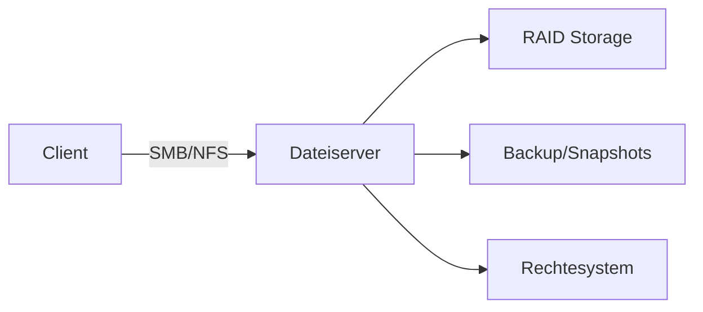

---
# Identity (stable; never change after publishing)
id: ap1-0254
slug: dateiserver-anforderungen

# Display
title: "Dateiserver – Hard- und Softwareanforderungen"

# Classification / navigation (machine-side)
module: "Entwickeln, Erstellen und Betreuen von IT_Lösungen"
topics: ["Server", "Netzwerk", "Dateisysteme"]
tags: ["ap1", "dateiserver", "anforderungen"]

# Flashcard payload
card:
  type: multi       # basic | multi | steps | definition | comparison
  question: "Welche Anforderungen an Hard- und Software muss ein Dateiserver im Unternehmen erfüllen?"
  answer: "Redundanz (Netzteil, Netzwerk, RAID), Zugriff über SMB/NFS, Rechteverwaltung, Backup/Snapshots, geringe Latenz, Remote-Zugriff, skalierbarer Speicher."
  examples: ["NAS im Unternehmen", "Fileserver mit RAID-Verbund und Backup"]

# Lifecycle
status: published       # draft | published | deprecated
created: "2026-03-18"
updated: "2026-03-18"
---

## Dateiserver – Hard- und Softwareanforderungen
Ein Dateiserver stellt zentral Speicherplatz für Benutzer und Anwendungen bereit.

Dabei müssen sowohl **Hardware- als auch Softwareanforderungen** erfüllt werden.

## Kernerklärung

### Hardware-Anforderungen
- redundantes Netzteil  
- redundanter Netzwerkzugriff  
- redundantes Plattensystem (RAID)  
- geringe Latenz (Netzwerk & Storage)  
- dynamisch erweiterbarer Speicher  

### Software-Anforderungen
- granularer Dateiberechtigungsmechanismus  
- Zugriff über Netzwerkprotokolle (SMB/NFS)  
- Unterstützung von Ordnerfreigaben  
- Backup und Snapshots zur Datensicherung  
- Fernzugriff (z. B. WebDAV, SFTP)  
- Zusammenarbeit ohne Versionskonflikte  

### Übersicht

| Bereich   | Anforderungen                                   |
|----------|--------------------------------------------------|
| Hardware | Redundanz, RAID, Performance, Skalierbarkeit     |
| Software | Rechte, Protokolle, Backup, Remote-Zugriff       |

## Praktisches Beispiel

- Unternehmen:
  - zentraler Fileserver für Abteilungen  
  - RAID-Verbund schützt vor Festplattenausfall  
  - tägliche Backups sichern Daten  

## Prüfungsrelevanz (AP1)

### Typische Prüfungsfragen
- Nenne Anforderungen an einen Dateiserver  
- Warum ist Redundanz wichtig?  
- Welche Protokolle werden verwendet?  

### Antworten auf die typischen Prüfungsfragen
- Redundanz, Rechteverwaltung, Backup, Zugriff  
- Redundanz schützt vor Ausfällen  
- SMB und NFS  

## Merksatz
Ein Dateiserver muss vor allem sicher, redundant, schnell und zentral zugänglich sein.