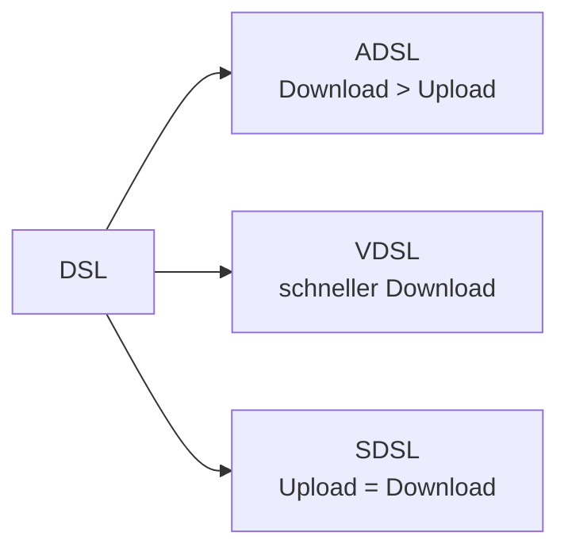

---
# Identity (stable; never change after publishing)
id: ap1-0255
slug: adsl-vdsl-sdsl-unterschiede

# Display
title: "ADSL, VDSL und SDSL – Unterschiede"

# Classification / navigation (machine-side)
module: "Entwickeln, Erstellen und Betreuen von IT_Lösungen"
topics: ["Netzwerk", "Internet", "Übertragungstechniken"]
tags: ["ap1", "dsl", "adsl", "vdsl", "sdsl"]

# Flashcard payload
card:
  type: comparison       # basic | multi | steps | definition | comparison
  question: "Wie unterscheiden sich ADSL, VDSL und SDSL voneinander?"
  answer: "ADSL/VDSL: asymmetrisch (Download > Upload), VDSL schneller. SDSL: symmetrisch (Upload = Download)."
  examples: ["ADSL für Privatkunden", "VDSL für schnelles Internet", "SDSL für Unternehmen"]

# Lifecycle
status: published       # draft | published | deprecated
created: "2026-03-18"
updated: "2026-03-18"
---

## ADSL, VDSL und SDSL – Unterschiede
DSL-Technologien werden zur Internetanbindung genutzt und unterscheiden sich vor allem in der **Übertragungsgeschwindigkeit und Symmetrie**.

## Kernerklärung

### ADSL (Asymmetric DSL)
- meistgenutzte Technik  
- **asymmetrisch**: Download schneller als Upload  
- typisch für Privatkunden  

### VDSL (Very High Speed DSL)
- Weiterentwicklung von ADSL  
- ebenfalls **asymmetrisch**  
- deutlich höhere Geschwindigkeiten  
- Download weiterhin schneller als Upload  

### SDSL (Symmetric DSL)
- **symmetrisch**: Upload = Download  
- für Echtzeitanwendungen geeignet  
- häufig in Unternehmen genutzt  

### Vergleich

| Technologie | Upload vs. Download | Geschwindigkeit | Einsatzgebiet        |
|------------|--------------------|-----------------|----------------------|
| ADSL       | asymmetrisch       | mittel          | Privatkunden         |
| VDSL       | asymmetrisch       | hoch            | modernes Internet    |
| SDSL       | symmetrisch        | stabil          | Unternehmen          |

## Praktisches Beispiel

- Zuhause:
  - ADSL oder VDSL für Streaming und Surfen  

- Unternehmen:
  - SDSL für stabile Uploads (z. B. Server, VoIP)  

## Prüfungsrelevanz (AP1)

### Typische Prüfungsfragen
- Was bedeutet asymmetrisch bei DSL?  
- Unterschied zwischen ADSL und VDSL?  
- Wann wird SDSL eingesetzt?  

### Antworten auf die typischen Prüfungsfragen
- Download ist schneller als Upload  
- VDSL ist schneller als ADSL  
- SDSL bei Bedarf nach gleichen Up-/Downloadraten  

## Merksatz
ADSL und VDSL sind asymmetrisch (Download schneller), SDSL ist symmetrisch (gleich schnell).