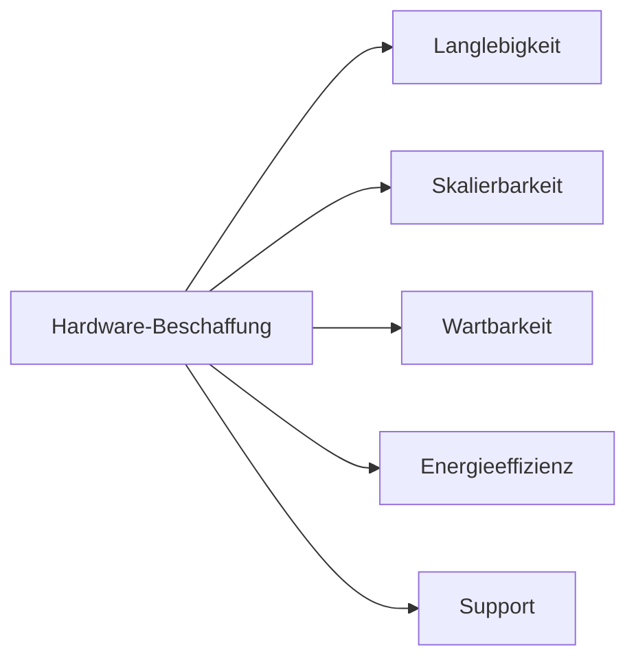

---
# Identity (stable; never change after publishing)
id: ap1-0257
slug: hardware-beschaffung-kriterien

# Display
title: "Beschaffung von IT-Hardware – Kriterien"

# Classification / navigation (machine-side)
module: "Entwickeln, Erstellen und Betreuen von IT_Lösungen"
topics: ["Hardware", "Beschaffung", "IT-Betrieb"]
tags: ["ap1", "hardware", "beschaffung"]

# Flashcard payload
card:
  type: multi       # basic | multi | steps | definition | comparison
  question: "Welche Kriterien sind bei der Beschaffung von IT-Hardware zu berücksichtigen?"
  answer: "Langlebigkeit, Skalierbarkeit, Support, geringer Stromverbrauch, Austauschbarkeit, Remote-Management und schnelle Ersatzbeschaffung."
  examples: ["Serverbeschaffung im Unternehmen", "Arbeitsplatz-PC Auswahl"]

# Lifecycle
status: published       # draft | published | deprecated
created: "2026-03-18"
updated: "2026-03-18"
---

## Beschaffung von IT-Hardware – Kriterien
Bei der Beschaffung von IT-Hardware müssen technische, wirtschaftliche und organisatorische Kriterien berücksichtigt werden.

Ziel ist eine **zuverlässige, langlebige und wartbare Infrastruktur**.

## Kernerklärung

### Wichtige Kriterien

- **Langlebigkeit**
  - z. B. mindestens 5 Jahre Herstellersupport  

- **Skalierbarkeit**
  - Erweiterbarkeit auf Basis vorhandener Hardware  

- **Support & Kosten**
  - kostengünstiger und verfügbarer Support  

- **Energieeffizienz**
  - geringer Stromverbrauch  
  - geringe Abwärme (umweltfreundlich)  

- **Wartbarkeit**
  - leicht austauschbare Komponenten  
  - schnelle Ersatzbeschaffung  

- **Management**
  - Remote-Management möglich  

### Übersicht

| Kategorie        | Beispiele                                   |
|------------------|---------------------------------------------|
| Technik          | Skalierbarkeit, Austauschbarkeit            |
| Betrieb          | Remote-Management, Support                  |
| Kosten           | Anschaffung + Betriebskosten                |
| Nachhaltigkeit   | Energieverbrauch, Abwärme                   |

## Praktisches Beispiel

- Server im Unternehmen:
  - RAID-fähig, erweiterbarer RAM  
  - Remote-Zugriff für Administration  
  - Ersatzteile schnell verfügbar  

## Prüfungsrelevanz (AP1)

### Typische Prüfungsfragen
- Nenne Kriterien für Hardwarebeschaffung  
- Warum ist Skalierbarkeit wichtig?  
- Welche Rolle spielt Energieeffizienz?  

### Antworten auf die typischen Prüfungsfragen
- Langlebigkeit, Support, Skalierbarkeit, Wartbarkeit  
- ermöglicht zukünftige Erweiterung  
- senkt Kosten und Umweltbelastung  

## Merksatz
Gute Hardware muss langlebig, erweiterbar, effizient und leicht wartbar sein.