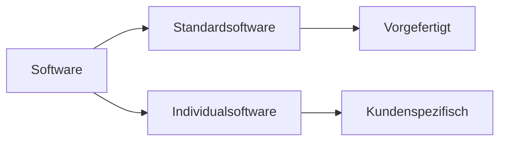

---
# Identity (stable; never change after publishing)
id: ap1-0258
slug: standardsoftware-definition

# Display
title: "Standardsoftware – Definition und Einordnung"

# Classification / navigation (machine-side)
module: "Entwickeln, Erstellen und Betreuen von IT_Lösungen"
topics: ["Software", "Softwarearten"]
tags: ["ap1", "standardsoftware", "software"]

# Flashcard payload
card:
  type: definition       # basic | multi | steps | definition | comparison
  question: "Wie definiert man den Begriff Standardsoftware?"
  answer: "Standardsoftware ist vorgefertigte, am Markt verfügbare Software, die ohne individuelle Entwicklung genutzt und ggf. angepasst werden kann."
  examples: ["Microsoft Office", "SAP", "ERP-Systeme"]

# Lifecycle
status: published       # draft | published | deprecated
created: "2026-03-18"
updated: "2026-03-18"
---

## Standardsoftware – Definition und Einordnung
Standardsoftware ist Software, die für eine breite Nutzergruppe entwickelt und **nicht speziell für einen einzelnen Kunden programmiert** wurde.

## Kernerklärung

- wird **auf dem freien Markt angeboten**  
- ist **vorgefertigt** und sofort einsetzbar  
- kann **konfiguriert oder angepasst** werden  
- im Gegensatz zu Individualsoftware:
  - keine Eigenentwicklung notwendig  

### Eigenschaften

| Merkmal            | Standardsoftware                     |
|--------------------|-------------------------------------|
| Entwicklung        | für viele Nutzer                    |
| Anpassung          | begrenzt möglich                    |
| Verfügbarkeit      | sofort nutzbar                      |
| Einsatz            | breit einsetzbar                    |

## Praktisches Beispiel

- Unternehmen:
  - Office-Programme für Mitarbeiter  
  - ERP-Systeme für Geschäftsprozesse  

- Einsatz:
  - Installation lokal (On-Premise)  
  - Nutzung als Cloud-/SaaS-Lösung  

## Prüfungsrelevanz (AP1)

### Typische Prüfungsfragen
- Was ist Standardsoftware?  
- Unterschied zu Individualsoftware?  
- Nenne Beispiele  

### Antworten auf die typischen Prüfungsfragen
- vorgefertigte Software für viele Nutzer  
- Individualsoftware wird speziell entwickelt  
- Beispiele: Office, ERP  

## Merksatz
Standardsoftware ist fertige Software für viele Nutzer – Individualsoftware ist maßgeschneidert.