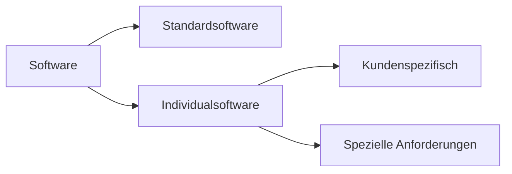

---
# Identity (stable; never change after publishing)
id: ap1-0259
slug: individualsoftware-definition

# Display
title: "Individualsoftware – Definition und Einordnung"

# Classification / navigation (machine-side)
module: "Entwickeln, Erstellen und Betreuen von IT_Lösungen"
topics: ["Software", "Softwarearten"]
tags: ["ap1", "individualsoftware", "software"]

# Flashcard payload
card:
  type: definition       # basic | multi | steps | definition | comparison
  question: "Wie wird der Begriff Individualsoftware definiert?"
  answer: "Individualsoftware ist speziell für einen bestimmten Anwender oder Anwendungsfall entwickelte Software, die individuelle Anforderungen erfüllt."
  examples: ["Firmenspezifisches ERP-System", "Individuelle Webanwendung"]

# Lifecycle
status: published       # draft | published | deprecated
created: "2026-03-18"
updated: "2026-03-18"
---

## Individualsoftware – Definition und Einordnung
Individualsoftware ist Software, die **maßgeschneidert für einen bestimmten Kunden oder Zweck** entwickelt wird.

## Kernerklärung

- wird **individuell entwickelt**  
- erfüllt **spezifische Anforderungen**  
- oft angepasst an:
  - Geschäftsprozesse  
  - Hardwareumgebungen  

- Gegensatz zu Standardsoftware:
  - nicht frei am Markt verfügbar  
  - speziell erstellt  

### Eigenschaften

| Merkmal            | Individualsoftware                  |
|--------------------|-----------------------------------|
| Entwicklung        | kundenspezifisch                  |
| Anpassung          | vollständig möglich               |
| Verfügbarkeit      | nicht sofort verfügbar            |
| Kosten             | meist höher                       |

## Praktisches Beispiel

- Unternehmen:
  - maßgeschneiderte Warenwirtschaft  
  - spezielle Produktionssoftware  

- Einsatz:
  - angepasst an interne Prozesse  
  - Integration in bestehende Systeme  

## Prüfungsrelevanz (AP1)

### Typische Prüfungsfragen
- Was ist Individualsoftware?  
- Unterschied zu Standardsoftware?  
- Wann wird sie eingesetzt?  

### Antworten auf die typischen Prüfungsfragen
- Software speziell für einen Kunden  
- Standardsoftware ist allgemein verfügbar  
- bei speziellen Anforderungen notwendig  

## Merksatz
Individualsoftware ist maßgeschneiderte Software für spezielle Anforderungen.