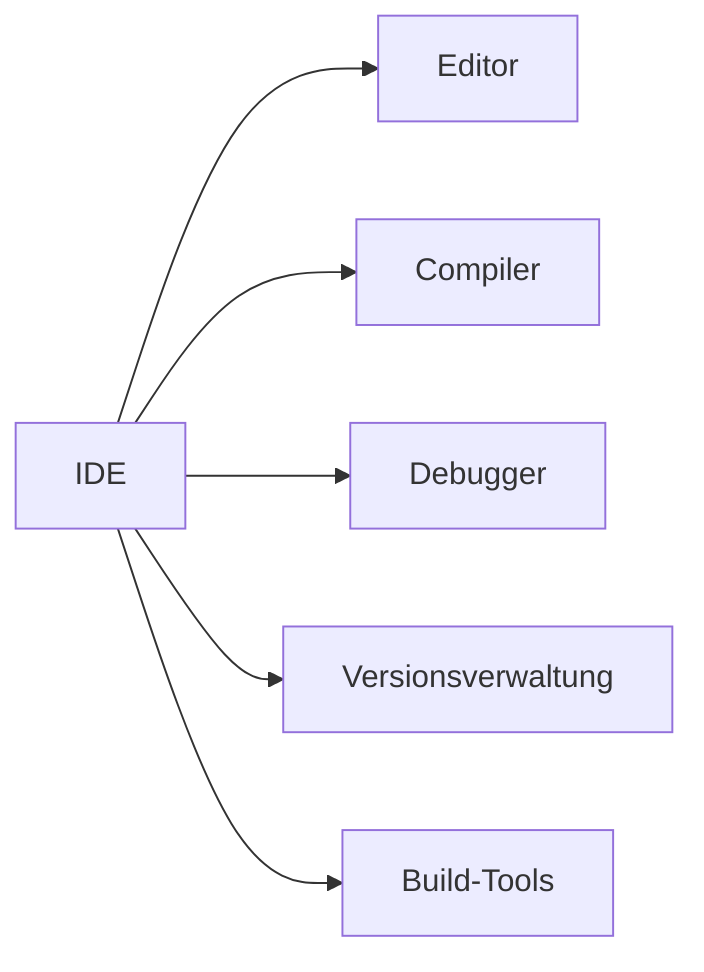

---
# Identity (stable; never change after publishing)
id: ap1-0260
slug: ide-definition

# Display
title: "IDE (Integrierte Entwicklungsumgebung)"

# Classification / navigation (machine-side)
module: "Entwickeln, Erstellen und Betreuen von IT_Lösungen"
topics: ["Softwareentwicklung", "Werkzeuge"]
tags: ["ap1", "ide", "entwicklung"]

# Flashcard payload
card:
  type: definition       # basic | multi | steps | definition | comparison
  question: "Wie definiert man in der Anwendungsentwicklung den Begriff IDE?"
  answer: "Eine IDE ist eine integrierte Entwicklungsumgebung, die verschiedene Werkzeuge zur Softwareentwicklung unter einer einheitlichen Oberfläche vereint."
  examples: ["Eclipse", "Visual Studio", "IntelliJ IDEA"]

# Lifecycle
status: published       # draft | published | deprecated
created: "2026-03-18"
updated: "2026-03-18"
---

## IDE (Integrierte Entwicklungsumgebung)
Eine IDE (Integrated Development Environment) ist eine Software, die Entwickler bei der Erstellung von Anwendungen unterstützt.

Sie bündelt mehrere Werkzeuge in einer einzigen Oberfläche.

## Kernerklärung

### Bestandteile einer IDE

- **Editor**
  - Schreiben von Quellcode  

- **Compiler / Interpreter**
  - Übersetzung bzw. Ausführung des Codes  

- **Debugger**
  - Fehleranalyse und -behebung  

- **Build-Tools**
  - Kompilierung und Projektverwaltung  

- **Versionsverwaltung**
  - z. B. Git-Integration  

### Ziel
- effizientere Entwicklung  
- einheitliche Arbeitsumgebung  
- weniger Tool-Wechsel  

## Praktisches Beispiel

- Entwickler arbeitet in **einer Anwendung**:
  - Code schreiben  
  - direkt testen  
  - Fehler debuggen  

- Beispiel:
  - Java-Entwicklung in IntelliJ oder Eclipse  

## Prüfungsrelevanz (AP1)

### Typische Prüfungsfragen
- Was ist eine IDE?  
- Welche Komponenten enthält sie?  
- Warum nutzt man eine IDE?  

### Antworten auf die typischen Prüfungsfragen
- integrierte Entwicklungsumgebung  
- Editor, Compiler, Debugger etc.  
- erleichtert und beschleunigt Entwicklung  

## Merksatz
Eine IDE vereint alle wichtigen Entwicklungswerkzeuge in einer einzigen Oberfläche.