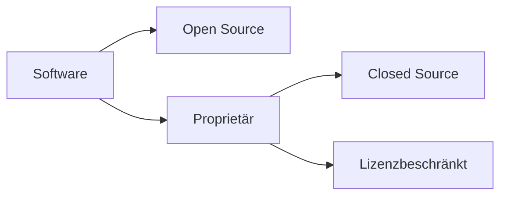

---
# Identity (stable; never change after publishing)
id: ap1-0261
slug: proprietaere-software-definition

# Display
title: "Proprietäre Software – Definition und Eigenschaften"

# Classification / navigation (machine-side)
module: "Entwickeln, Erstellen und Betreuen von IT_Lösungen"
topics: ["Software", "Softwarearten"]
tags: ["ap1", "proprietaer", "software"]

# Flashcard payload
card:
  type: definition       # basic | multi | steps | definition | comparison
  question: "Erkläre den Begriff proprietäre Software."
  answer: "Proprietäre Software ist Software, deren Nutzung, Weitergabe und Veränderung durch Lizenzbedingungen eingeschränkt ist und deren Quellcode meist nicht offen zugänglich ist."
  examples: ["Microsoft Windows", "Adobe Photoshop"]

# Lifecycle
status: published       # draft | published | deprecated
created: "2026-03-18"
updated: "2026-03-18"
---

## Proprietäre Software – Definition und Eigenschaften
Proprietäre Software ist Software, die unter **restriktiven Lizenzbedingungen** steht und nicht frei verändert oder weitergegeben werden darf.

## Kernerklärung

- Nutzung durch **Lizenz eingeschränkt**  
- **Weitergabe oft verboten oder eingeschränkt**  
- **Quellcode nicht öffentlich zugänglich**  

- häufig:
  - eigene Standards oder Schnittstellen  
  - eingeschränkte Anpassbarkeit  

### Eigenschaften

| Merkmal            | Proprietäre Software               |
|--------------------|----------------------------------|
| Quellcode          | nicht öffentlich                 |
| Nutzung            | lizenzgebunden                  |
| Anpassung          | eingeschränkt                   |
| Weitergabe         | meist verboten oder limitiert   |

## Praktisches Beispiel

- Betriebssysteme:
  - Windows  

- Anwendungen:
  - Adobe-Produkte  

- Einsatz:
  - Unternehmen nutzen Lizenzmodelle  
  - Updates und Support durch Hersteller  

## Prüfungsrelevanz (AP1)

### Typische Prüfungsfragen
- Was ist proprietäre Software?  
- Unterschied zu Open Source?  
- Welche Einschränkungen gibt es?  

### Antworten auf die typischen Prüfungsfragen
- Software mit eingeschränkten Nutzungsrechten  
- Open Source ist frei zugänglich  
- Nutzung, Weitergabe und Änderung eingeschränkt  

## Merksatz
Proprietäre Software = geschlossen, lizenzgebunden und eingeschränkt nutzbar.