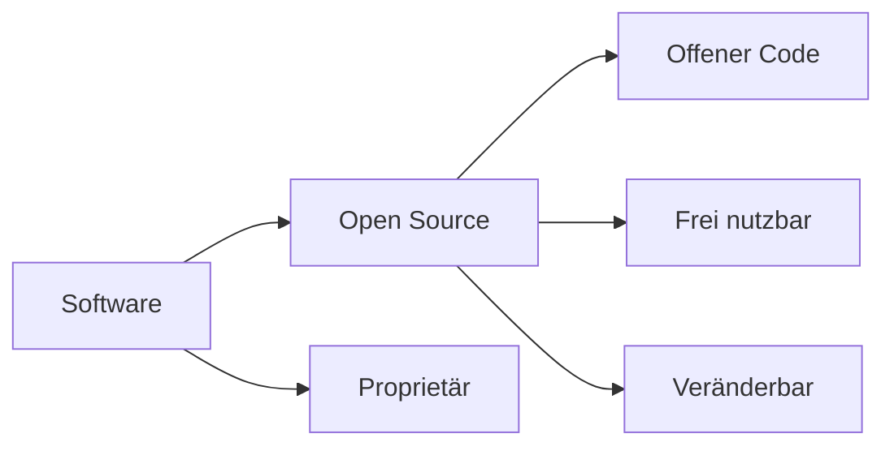

---
# Identity (stable; never change after publishing)
id: ap1-0262
slug: open-source-merkmale

# Display
title: "Open Source Software – Merkmale"

# Classification / navigation (machine-side)
module: "Entwickeln, Erstellen und Betreuen von IT_Lösungen"
topics: ["Software", "Softwarearten"]
tags: ["ap1", "open-source", "software"]

# Flashcard payload
card:
  type: multi       # basic | multi | steps | definition | comparison
  question: "Welche 3 charakteristischen Eigenschaften hat Open Source Software?"
  answer: "Quellcode ist öffentlich zugänglich, Software darf frei genutzt und verbreitet werden, sowie verändert und weitergegeben werden."
  examples: ["Linux", "Apache Webserver", "Mozilla Firefox"]

# Lifecycle
status: published       # draft | published | deprecated
created: "2026-03-18"
updated: "2026-03-18"
---

## Open Source Software – Merkmale
Open Source Software ist Software, deren **Quellcode öffentlich zugänglich** ist und von jedem genutzt, verändert und verbreitet werden darf.

## Kernerklärung

### Zentrale Merkmale

1. **Offener Quellcode**
   - lesbar und verständlich für Menschen  

2. **Freie Nutzung & Verbreitung**
   - beliebig kopierbar und nutzbar  

3. **Veränderbarkeit**
   - darf angepasst und weitergegeben werden  

### Eigenschaften im Überblick

| Merkmal            | Open Source Software             |
|--------------------|---------------------------------|
| Quellcode          | öffentlich                      |
| Nutzung            | frei                            |
| Anpassung          | erlaubt                         |
| Weitergabe         | erlaubt                         |

## Praktisches Beispiel

- Betriebssystem:
  - Linux  

- Software:
  - Firefox, LibreOffice  

- Einsatz:
  - Server, Entwicklung, Unternehmen  

## Prüfungsrelevanz (AP1)

### Typische Prüfungsfragen
- Nenne Merkmale von Open Source Software  
- Unterschied zu proprietärer Software  
- Welche Rechte hat der Nutzer?  

### Antworten auf die typischen Prüfungsfragen
- offener Quellcode, freie Nutzung, Veränderbarkeit  
- proprietär = eingeschränkt  
- Nutzung, Änderung und Weitergabe erlaubt  

## Merksatz
Open Source bedeutet: offen, frei nutzbar und veränderbar.