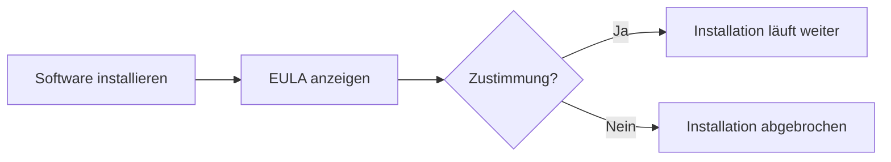

---
# Identity (stable; never change after publishing)
id: ap1-0265
slug: eula-definition

# Display
title: "EULA – Endbenutzer-Lizenzvereinbarung"

# Classification / navigation (machine-side)
module: "Entwickeln, Erstellen und Betreuen von IT_Lösungen"
topics: ["Software", "Lizenzierung"]
tags: ["ap1", "eula", "lizenz", "software"]

# Flashcard payload
card:
  type: definition       # basic | multi | steps | definition | comparison
  question: "Welchen Inhalt hat eine EULA (End User License Agreement) beim Installationsprozess von Software?"
  answer: "Eine EULA enthält die Lizenzbedingungen und Nutzungsregeln einer Software, denen der Nutzer vor der Installation zustimmen muss."
  examples: ["Zustimmungsdialog bei Softwareinstallation", "Lizenzbedingungen bei Windows-Installation"]

# Lifecycle
status: published       # draft | published | deprecated
created: "2026-03-18"
updated: "2026-03-18"
---

## EULA – Endbenutzer-Lizenzvereinbarung
Die EULA (End User License Agreement) ist ein zentraler Bestandteil bei der Installation von Software und regelt die **rechtlichen Nutzungsbedingungen**.

## Kernerklärung

- EULA = **Endbenutzer-Lizenzvereinbarung**
- definiert:
  - Nutzungsrechte  
  - Einschränkungen  
  - Weitergabe / Vervielfältigung  

- wichtig:
  - erscheint meist **zu Beginn der Installation**
  - Installation kann nur fortgesetzt werden, wenn:
    - der Nutzer zustimmt  

## Praktisches Beispiel

- Installation von:
  - Windows  
  - Office  
  - Anwendungen wie Browser  

- typischer Ablauf:
  - Lizenztext wird angezeigt  
  - Checkbox „Ich stimme zu“  
  - ohne Zustimmung → keine Installation  

## Prüfungsrelevanz (AP1)

### Typische Prüfungsfragen
- Was ist eine EULA?  
- Wann wird sie angezeigt?  
- Was passiert ohne Zustimmung?  

### Antworten auf die typischen Prüfungsfragen
- Lizenzvereinbarung für Software  
- Zu Beginn der Installation  
- Installation wird abgebrochen  

## Merksatz
Ohne Zustimmung zur EULA keine Nutzung der Software.